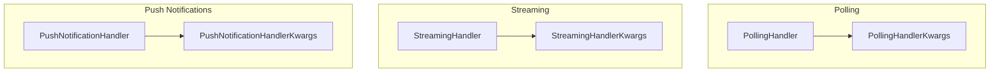

# a2a_updates
This module provides various handlers for managing asynchronous updates in A2A (Agent-to-Agent) communication, including polling, streaming, and push notification mechanisms, along with their respective configuration keyword arguments.

<!-- DIAGRAM_JSON
{
  "nodes": [
    {"id": "PollingHandlerKwargs", "label": "PollingHandlerKwargs", "type": "class"},
    {"id": "StreamingHandlerKwargs", "label": "StreamingHandlerKwargs", "type": "class"},
    {"id": "PushNotificationHandlerKwargs", "label": "PushNotificationHandlerKwargs", "type": "class"},
    {"id": "PollingHandler", "label": "PollingHandler", "type": "class"},
    {"id": "PushNotificationHandler", "label": "PushNotificationHandler", "type": "class"},
    {"id": "StreamingHandler", "label": "StreamingHandler", "type": "class"}
  ],
  "edges": [
    {"source": "PollingHandler", "target": "PollingHandlerKwargs", "label": "uses"},
    {"source": "StreamingHandler", "target": "StreamingHandlerKwargs", "label": "uses"},
    {"source": "PushNotificationHandler", "target": "PushNotificationHandlerKwargs", "label": "uses"}
  ],
  "groups": [
    {"id": "Polling", "label": "Polling", "nodes": ["PollingHandlerKwargs", "PollingHandler"]},
    {"id": "Streaming", "label": "Streaming", "nodes": ["StreamingHandlerKwargs", "StreamingHandler"]},
    {"id": "PushNotifications", "label": "Push Notifications", "nodes": ["PushNotificationHandlerKwargs", "PushNotificationHandler"]}
  ]
}
-->
