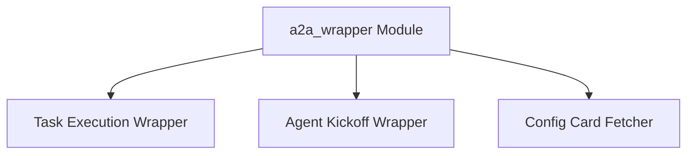

# `a2a_wrapper` Module Documentation

## Introduction

The `a2a_wrapper` module is a crucial component within the CrewAI framework, designed to facilitate seamless Agent-to-Agent (A2A) communication and delegation. It provides wrapper functions that augment standard agent task execution and kickoff processes with A2A capabilities, allowing agents to delegate tasks and coordinate actions effectively within a multi-agent system.

This module ensures that agents can leverage A2A features for both synchronous and asynchronous operations, enhancing the overall intelligence and collaborative potential of the CrewAI system.

## Architecture

The `a2a_wrapper` module is structured into several key sub-modules, each responsible for a specific aspect of A2A integration. The following diagram illustrates the relationships between these components:

<!-- DIAGRAM_JSON
{
    "direction": "TD",
    "nodes": [
        {"id": "a2a_wrapper", "label": "a2a_wrapper Module", "type": "module"},
        {"id": "task_execution_wrapper", "label": "Task Execution Wrapper", "type": "module", "link": "task_execution_wrapper.md"},
        {"id": "agent_kickoff_wrapper", "label": "Agent Kickoff Wrapper", "type": "module", "link": "agent_kickoff_wrapper.md"},
        {"id": "config_card_fetcher", "label": "Config Card Fetcher", "type": "module", "link": "config_card_fetcher.md"}
    ],
    "edges": [
        {"source": "a2a_wrapper", "target": "task_execution_wrapper"},
        {"source": "a2a_wrapper", "target": "agent_kickoff_wrapper"},
        {"source": "a2a_wrapper", "target": "config_card_fetcher"}
    ],
    "groups": []
}
-->

## Sub-modules

This section provides a high-level overview of the sub-modules within `a2a_wrapper`.

### [Task Execution Wrapper](task_execution_wrapper.md)

This sub-module contains the core logic for wrapping agent task execution with A2A delegation capabilities. It includes both synchronous (`execute_task_with_a2a`) and asynchronous (`aexecute_task_with_a2a`) methods that enable agents to delegate and manage tasks across the A2A communication layer.

### [Agent Kickoff Wrapper](agent_kickoff_wrapper.md)

The `agent_kickoff_wrapper` sub-module is responsible for integrating A2A delegation into the agent's kickoff process. It provides synchronous (`kickoff_with_a2a`) and asynchronous (`kickoff_async_with_a2a`) wrappers that allow agents to initiate their operations with A2A support, facilitating initial communication and coordination.

### [Config Card Fetcher](config_card_fetcher.md)

This sub-module provides utilities for fetching agent cards from A2A configuration objects (`_fetch_card_from_config`). Agent cards are essential for identifying and authenticating agents within the A2A ecosystem, making this component critical for establishing secure and proper A2A communication channels.
