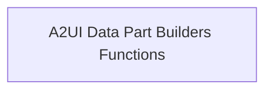

# A2UI Data Part Builders Module

## Introduction

The `a2ui_data_part_builders` module is responsible for constructing and validating data parts for Agent-to-UI (A2UI) messages within the CrewAI framework. It specifically handles different versions of the A2UI protocol, ensuring that messages conform to the expected structure before transmission.

## Architecture Overview

This module plays a crucial role in the A2UI server extension, preparing data for communication between agents and the user interface. It ensures data integrity and proper formatting based on the A2UI protocol versions.

<!-- DIAGRAM_JSON
{
    "direction": "TD",
    "nodes": [
        {"id": "a2ui_data_part_builders_functions", "label": "A2UI Data Part Builders Functions", "type": "module", "link": "a2ui_data_part_builders_functions.md"}
    ],
    "edges": [],
    "groups": []
}
-->

## Sub-modules

### [A2UI Data Part Builders Functions](a2ui_data_part_builders_functions.md)

This sub-module contains the core logic for validating and building A2UI data parts for different protocol versions (v0.8 and v0.9). It ensures that outgoing A2UI messages are correctly formatted and compliant with the respective A2UI schema, handling potential validation errors gracefully.