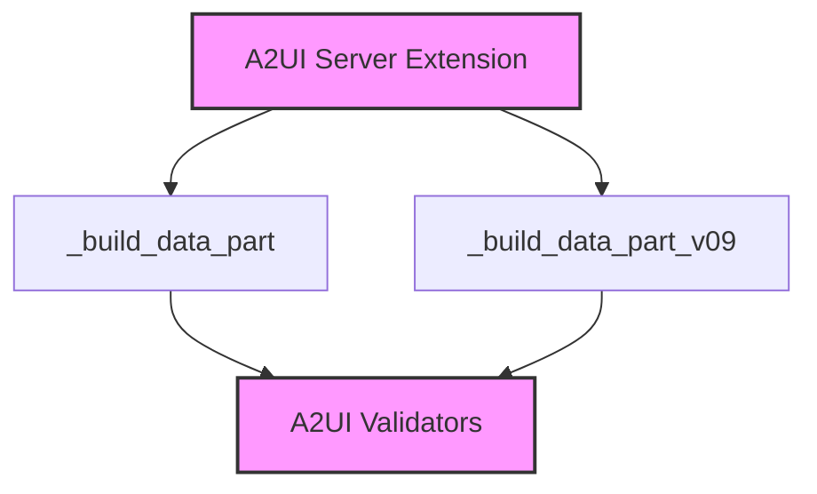

# a2ui_data_part_builders_functions

## Introduction
The `a2ui_data_part_builders_functions` module provides essential utility functions for constructing A2UI (Agent-to-Agent User Interface) data parts within the CrewAI framework. These functions are crucial for formatting and validating A2UI messages into a standardized `DataPart` dictionary structure, enabling seamless communication and rendering of agent interactions in the user interface.

## Purpose and Core Functionality
This module focuses on the validation and encapsulation of A2UI messages into a format suitable for transmission. It specifically handles two versions of A2UI messages, ensuring backward compatibility and future-proofing.

### Core Components

#### `_build_data_part`
This function is responsible for processing A2UI messages conforming to the v0.8 specification. It takes raw message data, attempts to validate it using the `validate_a2ui_message` function (likely found in the [a2ui_validators](a2ui_validators.md) module), and if successful, wraps the validated data into a `DataPart` dictionary. This dictionary includes metadata such as the `mimeType`, indicating that the content is an A2UI message. If validation fails, a warning is logged, and `None` is returned, preventing malformed messages from being transmitted.

#### `_build_data_part_v09`
Similar to `_build_data_part`, this function handles A2UI messages, but it is specifically designed for the v0.9 specification. It uses `validate_a2ui_message_v09` (also likely in the [a2ui_validators](a2ui_validators.md) module) for validation. The successful outcome is a `DataPart` dictionary formatted for v0.9 A2UI messages, ensuring that the latest protocol versions are correctly supported. Invalid messages are handled in the same way as `_build_data_part`.

## Architecture and Component Relationships

The `a2ui_data_part_builders_functions` module serves as a sub-component of the `a2ui_server_extension` module, which is part of the broader [a2a_a2ui_extensions](a2a_a2ui_extensions.md) system. It relies heavily on the validation capabilities provided by the [a2ui_validators](a2ui_validators.md) module to ensure data integrity before packaging.

<!-- DIAGRAM_JSON
{
    "direction": "TD",
    "nodes": [
        {"id": "_build_data_part", "label": "_build_data_part", "type": "component", "link": null},
        {"id": "_build_data_part_v09", "label": "_build_data_part_v09", "type": "component", "link": null},
        {"id": "a2ui_validators", "label": "A2UI Validators", "type": "external", "link": "a2ui_validators.md"},
        {"id": "a2ui_server_extension_core", "label": "A2UI Server Extension", "type": "external", "link": "a2ui_server_extension_core.md"}
    ],
    "edges": [
        {"source": "_build_data_part", "target": "a2ui_validators"},
        {"source": "_build_data_part_v09", "target": "a2ui_validators"},
        {"source": "a2ui_server_extension_core", "target": "_build_data_part"},
        {"source": "a2ui_server_extension_core", "target": "_build_data_part_v09"}
    ],
    "groups": []
}
-->

## How the Module Fits into the Overall System
This module plays a critical role in the Agent-to-Agent User Interface (A2UI) extension for CrewAI. It ensures that data generated by agents, intended for display or interaction through the UI, is correctly structured and validated before being sent. By providing dedicated functions for different A2UI message versions, it contributes to the robustness and maintainability of the A2UI communication layer. It is a fundamental part of the server-side A2UI extension, enabling the server to properly construct and send data parts to client-side A2UI components.
