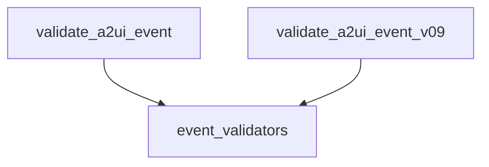

# `a2ui_event_validation`

## Introduction
The `a2ui_event_validation` module is a critical component within the Agent-to-Agent (A2A) communication system, specifically for the A2UI (Agent-to-Agent User Interface) extension. Its primary purpose is to ensure the integrity and conformity of incoming A2UI event data by validating it against predefined schemas. This validation process is essential to prevent malformed or unauthorized data from being processed, thereby maintaining the stability and reliability of agent interactions.

This module is part of the larger [a2a_a2ui_extensions module](a2a_a2ui_extensions.md), responsible for handling A2UI interactions within the CrewAI framework.

## Architecture and Component Relationships

The `a2ui_event_validation` module focuses on providing specialized functions for validating A2UI event data. It contains two core functions, each responsible for validating events against a specific version of the A2UI event schema.

The module is a sub-module of [event_validators](event_validators.md), which in turn is part of the [a2ui_validators](a2ui_validators.md) within the [a2a_a2ui_extensions](a2a_a2ui_extensions.md) architecture.

<!-- DIAGRAM_JSON
{
    "direction": "TD",
    "nodes": [
        {"id": "validate_a2ui_event", "label": "validate_a2ui_event", "type": "component", "link": null},
        {"id": "validate_a2ui_event_v09", "label": "validate_a2ui_event_v09", "type": "component", "link": null},
        {"id": "event_validators", "label": "event_validators", "type": "external", "link": "event_validators.md"}
    ],
    "edges": [
        {"source": "validate_a2ui_event", "target": "event_validators"},
        {"source": "validate_a2ui_event_v09", "target": "event_validators"}
    ],
    "groups": []
}
-->

## Core Functionality

This module exposes the following key functions:

### `validate_a2ui_event`
`lib.crewai.src.crewai.a2a.extensions.a2ui.validator.validate_a2ui_event`

This function is responsible for parsing and validating an A2UI client-to-server event against the standard `A2UIEvent` schema. It acts as a gatekeeper, ensuring that any incoming event data conforms to the expected structure and data types before further processing.

**Arguments**:
*   `data` (`dict[str, Any]`): The raw JSON-decoded event dictionary to be validated.

**Returns**:
*   `A2UIEvent`: A validated instance of the `A2UIEvent` model if the data is valid.

**Raises**:
*   `A2UIValidationError`: If the input `data` does not conform to the `A2UIEvent` schema, providing details about the validation errors.

### `validate_a2ui_event_v09`
`lib.crewai.src.crewai.a2a.extensions.a2ui.validator.validate_a2ui_event_v09`

Similar to `validate_a2ui_event`, this function is specifically designed to parse and validate A2UI client-to-server events that adhere to the A2UI v0.9 schema. It ensures backward compatibility and proper handling of events from older A2UI versions.

**Arguments**:
*   `data` (`dict[str, Any]`): The raw JSON-decoded event dictionary to be validated against the v0.9 schema.

**Returns**:
*   `A2UIEventV09`: A validated instance of the `A2UIEventV09` model if the data is valid.

**Raises**:
*   `A2UIValidationError`: If the input `data` does not conform to the `A2UIEventV09` schema, detailing the validation failures.