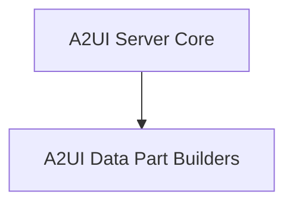

# a2ui_server_extension

The `a2ui_server_extension` module provides the server-side implementation for the A2UI (Agent-to-UI) declarative UI generation within the A2A (Agent-to-Agent) communication framework. It enables the CrewAI system to interact with user interfaces by negotiating catalog preferences and wrapping A2UI messages into A2A DataParts.

## Architecture Overview

The `a2ui_server_extension` module is composed of a core server extension class and utility functions for building data parts based on different A2UI protocol versions. It integrates with the broader A2A communication system to facilitate rich UI interactions.

<!-- DIAGRAM_JSON
{
    "direction": "TD",
    "nodes": [
        {"id": "a2ui_server_extension_core", "label": "A2UI Server Core", "type": "module", "link": "a2ui_server_extension_core.md"},
        {"id": "a2ui_data_part_builders", "label": "A2UI Data Part Builders", "type": "module", "link": "a2ui_data_part_builders.md"}
    ],
    "edges": [
        {"source": "a2ui_server_extension_core", "target": "a2ui_data_part_builders"}
    ],
    "groups": []
}
-->

## Sub-modules

### [A2UI Server Core](a2ui_server_extension_core.md)
This sub-module contains the `A2UIServerExtension` class, which is the central component for managing A2UI interactions on the server side. It handles the negotiation of UI catalog preferences with clients and orchestrates the wrapping of A2UI messages within A2A responses.

### [A2UI Data Part Builders](a2ui_data_part_builders.md)
This sub-module provides the necessary utility functions (`_build_data_part` and `_build_data_part_v09`) for validating A2UI messages and converting them into structured DataParts. These functions ensure that A2UI payloads are correctly formatted and adhere to the specified protocol versions (v0.8 and v0.9) before being sent as part of an A2A response.