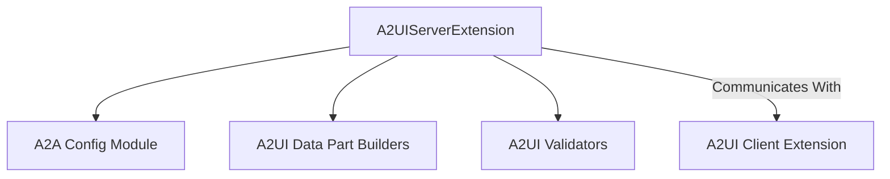

# `a2ui_server_extension_core`

## Introduction

The `a2ui_server_extension_core` module is a crucial component within the Agent-to-Agent (A2A) communication framework, specifically designed to enable declarative UI generation through the A2UI protocol. It facilitates the server-side handling of A2UI messages, allowing agents to generate and respond with rich, structured UI components.

## Purpose and Core Functionality

This module's primary purpose is to provide the `A2UIServerExtension`, a specialized server extension that integrates A2UI capabilities into the CrewAI A2A communication system. It supports both v0.8 and v0.9 of the A2UI protocol, ensuring compatibility with different client implementations.

The core functionalities of this module include:

*   **Catalog Negotiation:** During the `on_request` phase, the extension negotiates catalog preferences with the client. It identifies the desired A2UI catalog and stores it in the extension context for subsequent processing.
*   **A2UI Message Wrapping:** In the `on_response` phase, the extension scans the agent's response for A2UI JSON payloads. These payloads are then wrapped into A2A DataParts with the `application/json+a2ui` MIME type, complete with relevant A2UI metadata. This allows clients to interpret and render the declarative UI.
*   **Protocol Versioning:** The extension supports different versions of the A2UI protocol (v0.8 and v0.9), dynamically adjusting its URI and data part building/validation logic based on the configured version.

### `A2UIServerExtension`

```python
class A2UIServerExtension(ServerExtension):
    """A2A server extension that enables A2UI declarative UI generation.

    Supports both v0.8 and v0.9 of the A2UI protocol via the ``version``
    parameter.  When activated by a client, this extension:

    * Negotiates catalog preferences during ``on_request``.
    * Wraps A2UI messages in the agent response as A2A DataParts with
      ``application/json+a2ui`` MIME type during ``on_response``.

    Example::

        A2AServerConfig
            server_extensions=[A2UIServerExtension],
            default_output_modes=["text/plain", "application/json+a2ui"],
    """
    # ... (code details)
```

This class is the central component, inheriting from `ServerExtension` and implementing the logic for A2UI integration. It is configured with `catalog_ids`, `accept_inline_catalogs`, and a `version` parameter to specify the A2UI protocol version.

## Architecture and Component Relationships

The `a2ui_server_extension_core` module, through its `A2UIServerExtension`, plays a vital role within the larger [a2a_agent_to_agent_communication](a2a_agent_to_agent_communication.md) framework. It specifically operates within the [a2a_a2ui_extensions](a2a_a2ui_extensions.md) sub-system, working in conjunction with other A2UI-related modules.

It depends on configuration settings defined in [a2a_config](a2a_config.md) for its activation and behavior. For processing A2UI messages, it leverages functions from the [a2ui_data_part_builders](a2ui_data_part_builders.md) to construct appropriate DataParts and from [a2ui_validators](a2ui_validators.md) for extracting and validating A2UI payloads from raw responses. On the client side, it interacts with the [a2ui_client_extension](a2ui_client_extension.md) to establish and maintain the A2UI communication.

<!-- DIAGRAM_JSON
{
    "direction": "TD",
    "nodes": [
        {"id": "a2ui_server_extension", "label": "A2UIServerExtension", "type": "component", "link": null},
        {"id": "a2a_config", "label": "A2A Config Module", "type": "external", "link": "a2a_config.md"},
        {"id": "a2ui_data_part_builders", "label": "A2UI Data Part Builders", "type": "external", "link": "a2ui_data_part_builders.md"},
        {"id": "a2ui_validators", "label": "A2UI Validators", "type": "external", "link": "a2ui_validators.md"},
        {"id": "a2ui_client_extension", "label": "A2UI Client Extension", "type": "external", "link": "a2ui_client_extension.md"}
    ],
    "edges": [
        {"source": "a2ui_server_extension", "target": "a2a_config"},
        {"source": "a2ui_server_extension", "target": "a2ui_data_part_builders"},
        {"source": "a2ui_server_extension", "target": "a2ui_validators"},
        {"source": "a2ui_server_extension", "target": "a2ui_client_extension", "label": "Communicates With"}
    ],
    "groups": []
}
-->


## How the Module Fits into the Overall System

The `a2ui_server_extension_core` module is an enabler for rich, interactive agent experiences within the CrewAI ecosystem. By providing a standardized way for agents to emit UI instructions, it allows for the development of sophisticated agent interfaces that go beyond plain text. This is particularly relevant for applications where agents need to present complex data, solicit structured input from users, or guide users through multi-step processes using a declarative UI paradigm.

It effectively bridges the gap between agent logic and user interface rendering, making agent interactions more intuitive and powerful. As part of the A2A extension system, it ensures that A2UI capabilities can be seamlessly integrated and managed within the broader agent communication infrastructure, promoting modularity and extensibility.