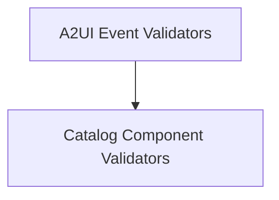

# a2ui_validators Module Documentation

## Introduction and Purpose
This module is responsible for validating A2UI (Agent-to-Agent User Interface) events and component catalog messages within the CrewAI framework. It ensures that data exchanged between A2UI clients and servers conforms to defined schemas, preventing malformed data from causing issues.

## Architecture Overview
The `a2ui_validators` module is a part of the `a2a_a2ui_extensions` module, specifically focusing on the validation aspect of A2UI interactions. It contains sub-modules for validating A2UI events and catalog components.

## High-level functionality of each sub-module
- [A2UI Event Validators](event_validators.md): This sub-module handles the validation of A2UI client-to-server events, ensuring they adhere to the A2UI event schema.
- [Catalog Component Validators](catalog_validators.md): This sub-module is responsible for validating component properties within `updateComponents` messages against a basic catalog for v0.9 A2UI messages.

<!-- DIAGRAM_JSON
{
    "direction": "TD",
    "nodes": [
        {"id": "event_validators", "label": "A2UI Event Validators", "type": "module", "link": "event_validators.md"},
        {"id": "catalog_validators", "label": "Catalog Component Validators", "type": "module", "link": "catalog_validators.md"}
    ],
    "edges": [
        {"source": "event_validators", "target": "catalog_validators"}
    ],
    "groups": []
}
-->

