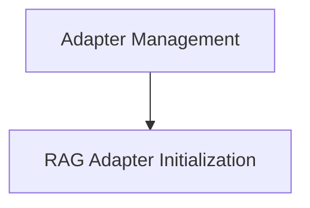

# Adapter Management Module

The `adapter_management` module plays a crucial role in managing and ensuring the correct initialization of RAG (Retrieval Augmented Generation) adapters within the CrewAI tools ecosystem. Its primary purpose is to provide a flexible mechanism for dynamically setting up the appropriate RAG adapter based on configuration, replacing placeholder implementations with concrete ones when needed.

## Architecture Overview

The `adapter_management` module is a sub-module of `crewai_tools_platform_automation` and specifically part of the `rag_tool_internals` within the `crewai_tools_platform_automation` module. It focuses on the core logic for ensuring that the RAG tool has a functional adapter for performing retrieval operations.

<!-- DIAGRAM_JSON
{
    "direction": "TD",
    "nodes": [
        {"id": "rag_adapter_initialization", "label": "RAG Adapter Initialization", "type": "module", "link": "rag_adapter_initialization.md"}
    ],
    "edges": [],
    "groups": []
}
-->

## Sub-modules

### [RAG Adapter Initialization](rag_adapter_initialization.md)

This sub-module is responsible for handling the dynamic initialization and replacement of the RAG adapter within the `RagTool`. It ensures that when the `RagTool` is used, a concrete implementation of an adapter, such as `CrewAIRagAdapter`, is in place to manage collection queries and document additions. If a placeholder adapter is detected, it is replaced with a fully configured adapter, allowing for seamless integration with various RAG providers.

For more detailed information, please refer to the [RAG Adapter Initialization documentation](rag_adapter_initialization.md).