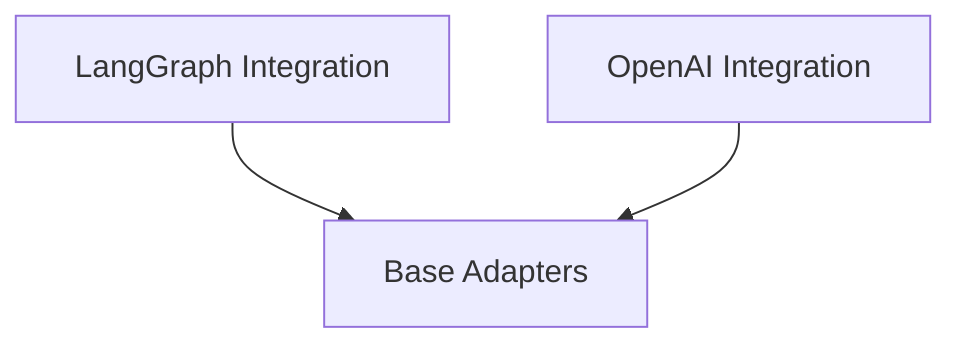

# agent_adapters Module Documentation

## Introduction

The `agent_adapters` module in CrewAI is responsible for abstracting the underlying agent implementations, allowing CrewAI to seamlessly integrate with various agent frameworks like LangGraph and OpenAI Assistants. It provides a standardized interface for agents to perform tasks, manage tools, and handle structured output, promoting flexibility and extensibility within the CrewAI ecosystem.

## Architecture Overview

The `agent_adapters` module is structured around a base adapter for common functionalities and specific adapters for different agent frameworks. The `base_adapters` sub-module defines the core mechanisms for structured output conversion. Building upon this, `langgraph_integration` and `openai_integration` provide concrete implementations for integrating LangGraph and OpenAI-based agents, respectively. Both specialized adapters leverage the functionalities provided by the `base_adapters` to ensure consistent handling of structured outputs.

<!-- DIAGRAM_JSON
{
    "direction": "TD",
    "nodes": [
        {"id": "base_adapters", "label": "Base Adapters", "type": "module", "link": "base_adapters.md"},
        {"id": "langgraph_integration", "label": "LangGraph Integration", "type": "module", "link": "langgraph_integration.md"},
        {"id": "openai_integration", "label": "OpenAI Integration", "type": "module", "link": "openai_integration.md"}
    ],
    "edges": [
        {"source": "langgraph_integration", "target": "base_adapters"},
        {"source": "openai_integration", "target": "base_adapters"}
    ],
    "groups": []
}
-->

## Sub-modules

*   **[Base Adapters](base_adapters.md)**
    This sub-module provides abstract base classes and utility functions that define the common interface and foundational logic for agent output conversion and structured output handling across different agent implementations.

*   **[LangGraph Integration](langgraph_integration.md)**
    This sub-module focuses on integrating LangGraph's ReAct agents with the CrewAI framework. It handles aspects such as memory persistence, tool integration, and ensuring that LangGraph agents can produce structured outputs compliant with CrewAI standards.

*   **[OpenAI Integration](openai_integration.md)**
    This sub-module is dedicated to adapting the OpenAI Assistants API for use within CrewAI. It manages the configuration of OpenAI tools, handles structured output according to OpenAI's capabilities, and orchestrates the execution of tasks through OpenAI Assistants.