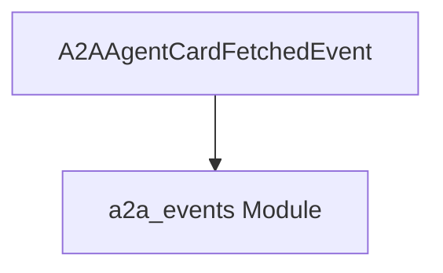

# Module: agent_card_events

## Introduction
The `agent_card_events` module defines event types specifically related to the fetching of Agent-to-Agent (A2A) agent cards within the CrewAI system. These events are crucial for monitoring and reacting to the lifecycle of agent card retrieval, providing insights into whether a card was successfully fetched, its source (e.g., cache), and associated metadata.

## Core Functionality
This module's primary function is to encapsulate the data and context around the successful fetching of an A2A agent card. It provides a standardized event structure that can be emitted and consumed by other parts of the system, particularly within the [crewai_event_system](crewai_event_system.md) and [crewai_agent_to_agent_communication](crewai_agent_to_agent_communication.md) modules.

### Components
The `agent_card_events` module currently contains the following core component:

### `A2AAgentCardFetchedEvent`
This event is emitted when an A2A agent card is successfully retrieved. It extends the base `A2AEventBase` (defined in [a2a_events](a2a_events.md)) and includes detailed information about the fetched card.

**Attributes:**
*   `type`: A string indicating the event type, set to `"a2a_agent_card_fetched"`.
*   `endpoint`: The URL of the A2A agent endpoint.
*   `a2a_agent_name`: The name of the A2A agent.
*   `agent_card`: The full metadata of the A2A agent card.
*   `protocol_version`: The A2A protocol version specified in the agent card.
*   `provider`: Information about the agent's provider or organization.
*   `cached`: A boolean indicating whether the agent card was retrieved from a cache.
*   `fetch_time_ms`: The time taken (in milliseconds) to fetch the agent card.
*   `metadata`: Custom key-value pairs for additional A2A metadata.

## Architecture and Component Relationships

The `agent_card_events` module is a leaf module within the broader [crewai_event_system](crewai_event_system.md), specifically nested under `a2a_events` and `notification_events`. It relies on the `A2AEventBase` from the [a2a_events](a2a_events.md) module, establishing an inheritance relationship. This module's events are designed to be consumed by event listeners throughout the CrewAI system to react to agent card fetching activities.

<!-- DIAGRAM_JSON
{
    "direction": "TD",
    "nodes": [
        {"id": "A2AAgentCardFetchedEvent", "label": "A2AAgentCardFetchedEvent", "type": "component", "link": null},
        {"id": "a2a_events_module", "label": "a2a_events Module", "type": "external", "link": "a2a_events.md"}
    ],
    "edges": [
        {"source": "A2AAgentCardFetchedEvent", "target": "a2a_events_module"}
    ],
    "groups": []
}
-->
