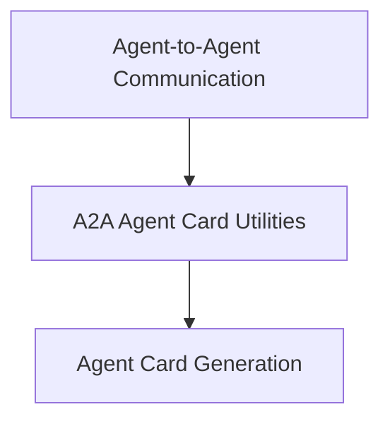

# Agent Card Generation

## Introduction and Purpose
The `agent_card_generation` module is a crucial component within the Agent-to-Agent (A2A) communication utilities, specifically located under `crewai_agent_to_agent_communication.md`. Its primary purpose is to facilitate the creation of `AgentCard` objects from `Agent` or `Crew` instances. These `AgentCard`s serve as descriptive manifests of an agent's or crew's capabilities, enabling discovery and interaction within the CrewAI framework.

## Architecture Overview
This module resides within the `a2a_agent_card_utils` sub-module of `crewai_agent_to_agent_communication`. It directly utilizes core components to transform CrewAI agent and crew configurations into a standardized `AgentCard` format.

<!-- DIAGRAM_JSON
{
    "direction": "TD",
    "nodes": [
        {"id": "crewai_agent_to_agent_communication", "label": "Agent-to-Agent Communication", "type": "module", "link": "crewai_agent_to_agent_communication.md"},
        {"id": "a2a_agent_card_utils", "label": "A2A Agent Card Utilities", "type": "module", "link": "a2a_agent_card_utils.md"},
        {"id": "agent_card_generation", "label": "Agent Card Generation", "type": "module", "link": "agent_card_generation.md"}
    ],
    "edges": [
        {"source": "crewai_agent_to_agent_communication", "target": "a2a_agent_card_utils"},
        {"source": "a2a_agent_card_utils", "target": "agent_card_generation"}
    ],
    "groups": []
}
-->

## Core Functionality

### `_to_agent_card`
This function is responsible for generating an `AgentCard` from a single `Agent` instance. It acts as a wrapper, delegating the actual conversion process to an internal helper function, `_agent_to_agent_card`. This ensures that individual agents can also be represented by an `AgentCard` for A2A interactions.

### `_crew_to_agent_card`
This function creates an `AgentCard` from a `Crew` instance. It intelligently extracts relevant information such as the crew's name, description (or dynamically generates one based on the roles of its constituent agents), and skills derived from the tasks assigned to the crew. It also populates the `AgentCard` with default capabilities like streaming and push notifications, and specifies supported input and output content types. This function is vital for presenting a comprehensive overview of a crew's operational profile in the A2A ecosystem.
