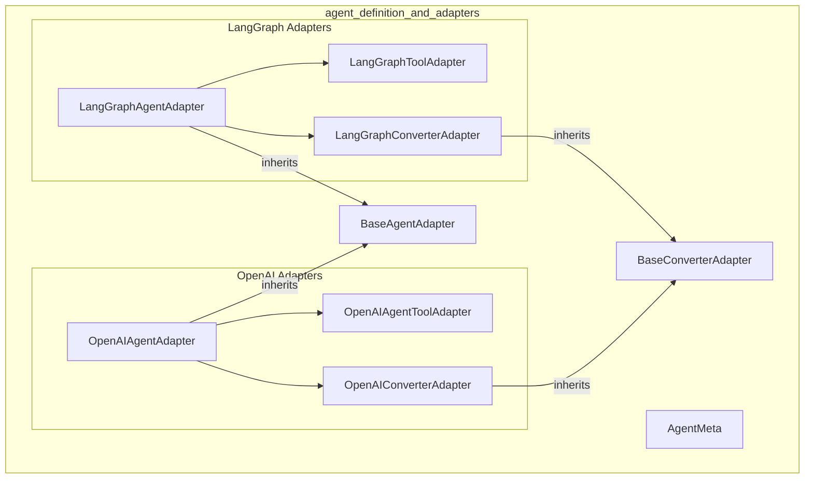

# agent_definition_and_adapters
This module defines agent metaclasses and provides adapters for integrating LangGraph and OpenAI Assistants into CrewAI, enabling structured output and tool management.

<!-- DIAGRAM_JSON
{
  "nodes": [
    {
      "id": "AgentMeta",
      "label": "lib.crewai.src.crewai.agent.internal.meta.AgentMeta"
    },
    {
      "id": "BaseConverterAdapter",
      "label": "lib.crewai.src.crewai.agents.agent_adapters.base_converter_adapter.BaseConverterAdapter"
    },
    {
      "id": "LangGraphAgentAdapter",
      "label": "lib.crewai.src.crewai.agents.agent_adapters.langgraph.langgraph_adapter.LangGraphAgentAdapter"
    },
    {
      "id": "OpenAIAgentAdapter",
      "label": "lib.crewai.src.crewai.agents.agent_adapters.openai_agents.openai_adapter.OpenAIAgentAdapter"
    },
    {
      "id": "BaseAgentAdapter",
      "label": "BaseAgentAdapter"
    },
    {
      "id": "LangGraphToolAdapter",
      "label": "LangGraphToolAdapter"
    },
    {
      "id": "LangGraphConverterAdapter",
      "label": "LangGraphConverterAdapter"
    },
    {
      "id": "OpenAIAgentToolAdapter",
      "label": "OpenAIAgentToolAdapter"
    },
    {
      "id": "OpenAIConverterAdapter",
      "label": "OpenAIConverterAdapter"
    }
  ],
  "edges": [
    {
      "source": "LangGraphAgentAdapter",
      "target": "BaseAgentAdapter",
      "type": "inheritance"
    },
    {
      "source": "OpenAIAgentAdapter",
      "target": "BaseAgentAdapter",
      "type": "inheritance"
    },
    {
      "source": "LangGraphAgentAdapter",
      "target": "LangGraphToolAdapter",
      "type": "composition"
    },
    {
      "source": "LangGraphAgentAdapter",
      "target": "LangGraphConverterAdapter",
      "type": "composition"
    },
    {
      "source": "OpenAIAgentAdapter",
      "target": "OpenAIAgentToolAdapter",
      "type": "composition"
    },
    {
      "source": "OpenAIAgentAdapter",
      "target": "OpenAIConverterAdapter",
      "type": "composition"
    },
    {
      "source": "LangGraphConverterAdapter",
      "target": "BaseConverterAdapter",
      "type": "inheritance"
    },
    {
      "source": "OpenAIConverterAdapter",
      "target": "BaseConverterAdapter",
      "type": "inheritance"
    }
  ],
  "groups": [
    {
      "id": "agent_definition_and_adapters",
      "label": "agent_definition_and_adapters",
      "nodes": [
        "AgentMeta",
        "BaseConverterAdapter",
        "LangGraphAgentAdapter",
        "OpenAIAgentAdapter",
        "BaseAgentAdapter",
        "LangGraphToolAdapter",
        "LangGraphConverterAdapter",
        "OpenAIAgentToolAdapter",
        "OpenAIConverterAdapter"
      ]
    },
    {
      "id": "LangGraph Adapters",
      "label": "LangGraph Adapters",
      "nodes": [
        "LangGraphAgentAdapter",
        "LangGraphToolAdapter",
        "LangGraphConverterAdapter"
      ]
    },
    {
      "id": "OpenAI Adapters",
      "label": "OpenAI Adapters",
      "nodes": [
        "OpenAIAgentAdapter",
        "OpenAIAgentToolAdapter",
        "OpenAIConverterAdapter"
      ]
    }
  ]
}
-->
