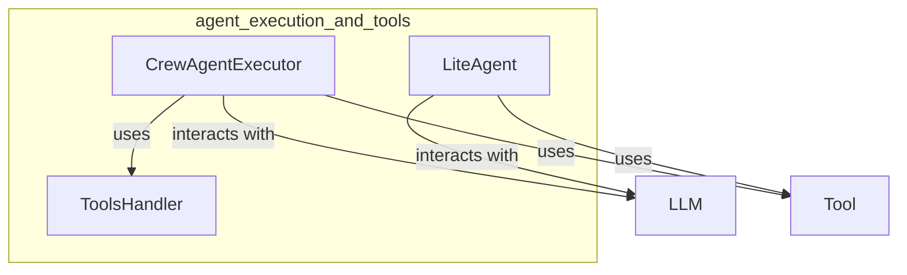

# agent_execution_and_tools
This module defines components for agent execution, including an executor for crew agents, a handler for tool interactions, and a lightweight agent for direct processing.

<!-- DIAGRAM_JSON
{
  "nodes": [
    {"id": "A", "label": "CrewAgentExecutor"},
    {"id": "B", "label": "ToolsHandler"},
    {"id": "C", "label": "LiteAgent"},
    {"id": "D", "label": "LLM", "type": "external"},
    {"id": "E", "label": "Tool", "type": "external"}
  ],
  "edges": [
    {"source": "A", "target": "B", "label": "uses"},
    {"source": "A", "target": "D", "label": "interacts with"},
    {"source": "A", "target": "E", "label": "uses"},
    {"source": "C", "target": "D", "label": "interacts with"},
    {"source": "C", "target": "E", "label": "uses"}
  ],
  "groups": [
    {"id": "agent_execution_and_tools", "label": "agent_execution_and_tools", "nodes": ["A", "B", "C"]}
  ]
}
-->
