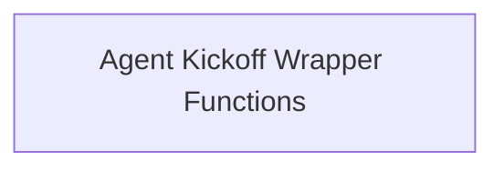

# Agent Kickoff Functions

This module provides the core functionalities for initiating agent tasks, specifically focusing on integrating Agent-to-Agent (A2A) delegation capabilities into the agent kickoff process. It offers both synchronous and asynchronous methods to start agents, ensuring that A2A configurations are properly handled.

## Architecture

This module primarily interacts with a single sub-module that encapsulates the actual kickoff logic.

<!-- DIAGRAM_JSON
{
    "direction": "TD",
    "nodes": [
        {"id": "agent_kickoff_wrapper_functions", "label": "Agent Kickoff Wrapper Functions", "type": "module", "link": "agent_kickoff_wrapper_functions.md"}
    ],
    "edges": [],
    "groups": []
}
-->

## Sub-modules

### [Agent Kickoff Wrapper Functions](agent_kickoff_wrapper_functions.md)
This sub-module contains the synchronous and asynchronous functions responsible for kicking off agents while incorporating A2A delegation logic. It ensures that if A2A is enabled for an agent, the appropriate A2A mechanisms are engaged; otherwise, it defers to the original kickoff methods.