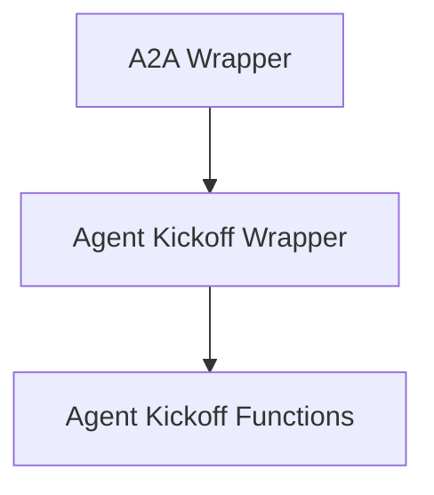

# Agent Kickoff Wrapper Module

## Introduction
The `agent_kickoff_wrapper` module is responsible for orchestrating the initiation of agent tasks, specifically integrating Agent-to-Agent (A2A) delegation capabilities. It provides methods to kick off agent execution, both synchronously and asynchronously, ensuring that A2A configurations are respected and applied. This module acts as a critical entry point for starting agent workflows that might involve inter-agent communication.

## Architecture
The `agent_kickoff_wrapper` module is a sub-module of the `a2a_wrapper` module, which handles general A2A delegation logic. It contains core functions for initiating agent tasks, leveraging the A2A configuration to determine if and how delegation should occur.

<!-- DIAGRAM_JSON
{
    "direction": "TD",
    "nodes": [
        {"id": "a2a_wrapper", "label": "A2A Wrapper", "type": "module", "link": "a2a_wrapper.md"},
        {"id": "agent_kickoff_wrapper", "label": "Agent Kickoff Wrapper", "type": "module", "link": "agent_kickoff_wrapper.md"},
        {"id": "agent_kickoff_functions", "label": "Agent Kickoff Functions", "type": "module", "link": "agent_kickoff_functions.md"}
    ],
    "edges": [
        {"source": "a2a_wrapper", "target": "agent_kickoff_wrapper"},
        {"source": "agent_kickoff_wrapper", "target": "agent_kickoff_functions"}
    ],
    "groups": []
}
-->

## High-Level Functionality

### [Agent Kickoff Functions](agent_kickoff_functions.md)
This sub-module contains the core logic for initiating agent tasks, with specific implementations for both synchronous and asynchronous execution. It integrates with the A2A configuration to manage delegation and ensures a smooth kickoff process.
