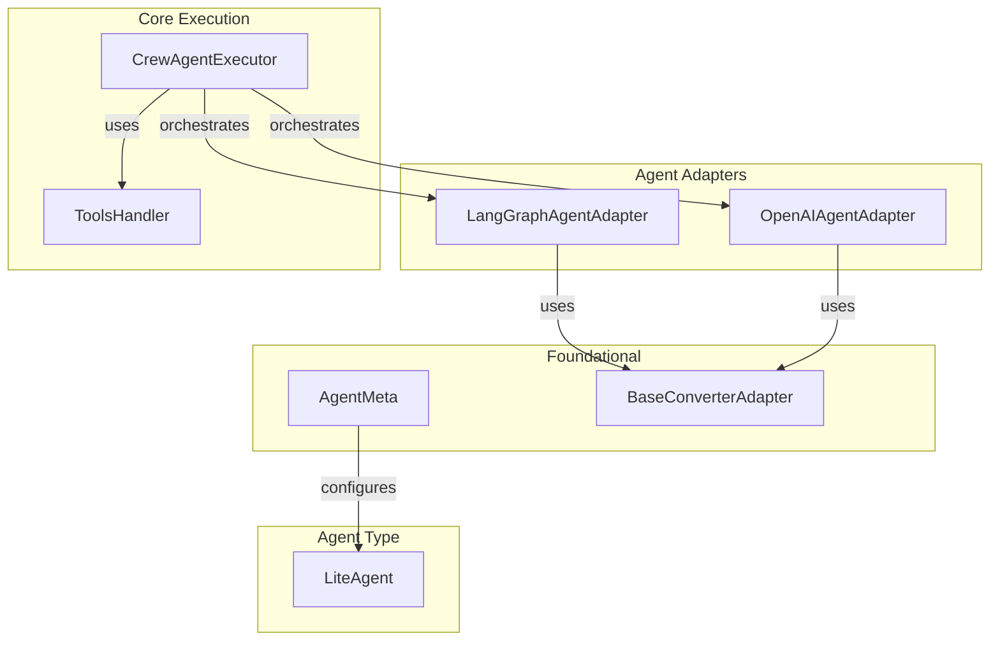

# agent_orchestration
This module provides core components for agent orchestration within CrewAI, including agent adapters for different LLM frameworks, an executor for managing agent lifecycles, and utilities for structured output and tool handling.

<!-- DIAGRAM_JSON
{
    "nodes": [
        {
            "id": "A1",
            "label": "AgentMeta"
        },
        {
            "id": "A2",
            "label": "BaseConverterAdapter"
        },
        {
            "id": "A3",
            "label": "LangGraphAgentAdapter"
        },
        {
            "id": "A4",
            "label": "OpenAIAgentAdapter"
        },
        {
            "id": "A5",
            "label": "CrewAgentExecutor"
        },
        {
            "id": "A6",
            "label": "ToolsHandler"
        },
        {
            "id": "A7",
            "label": "LiteAgent"
        }
    ],
    "edges": [
        {
            "source": "A3",
            "target": "A2",
            "label": "uses"
        },
        {
            "source": "A4",
            "target": "A2",
            "label": "uses"
        },
        {
            "source": "A5",
            "target": "A6",
            "label": "uses"
        },
        {
            "source": "A1",
            "target": "A7",
            "label": "configures"
        },
        {
            "source": "A5",
            "target": "A3",
            "label": "orchestrates"
        },
        {
            "source": "A5",
            "target": "A4",
            "label": "orchestrates"
        }
    ],
    "groups": [
        {
            "id": "agent_adapters",
            "label": "Agent Adapters",
            "nodes": [
                "A3",
                "A4"
            ]
        },
        {
            "id": "core_execution",
            "label": "Core Execution",
            "nodes": [
                "A5",
                "A6"
            ]
        },
        {
            "id": "foundational",
            "label": "Foundational",
            "nodes": [
                "A1",
                "A2"
            ]
        },
        {
            "id": "agent_type",
            "label": "Agent Type",
            "nodes": [
                "A7"
            ]
        }
    ]
}
-->
