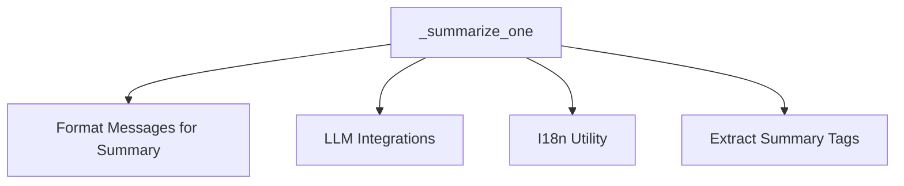

# `agent_summarization` Module Documentation

## Introduction

The `agent_summarization` module is a crucial component within the `crewai_utilities` package, specifically designed to condense and summarize agent conversations. Its primary role is to process raw LLM message chunks, extract key information, and present it in a digestible format. This functionality is essential for managing context in long-running agent interactions, enhancing readability of agent logs, and facilitating efficient understanding of complex multi-agent workflows.

## Purpose and Core Functionality

The main purpose of the `agent_summarization` module is to provide a robust and efficient mechanism for summarizing agent communication. The core functionality revolves around the `_summarize_one` asynchronous function, which performs the following steps:

1.  **Message Formatting**: It takes a list of `LLMMessage` objects (representing a chunk of conversation) and formats them into a coherent text string suitable for summarization by a Large Language Model.
2.  **Prompt Construction**: It dynamically constructs summarization prompts using predefined system messages and instructions, retrieved from an internationalization (i18n) utility. This ensures consistent and context-aware summarization.
3.  **LLM Interaction**: It leverages an external LLM integration to asynchronously send the formatted conversation and summarization prompts to a language model for processing.
4.  **Summary Extraction**: After receiving the LLM's response, it extracts the actual summary content, typically by identifying specific tags or patterns within the response.

This process ensures that agents can maintain effective communication without being overwhelmed by excessive message history, and that human operators can quickly grasp the essence of agent interactions.

## Architecture and Component Relationships

The `agent_summarization` module is a leaf module, focusing on a specific utility within the `crewai_utilities` ecosystem. Its architecture is streamlined, with the `_summarize_one` function acting as the central orchestrator for the summarization process. It interacts with several internal helper functions and external modules to achieve its goal.

<!-- DIAGRAM_JSON
{
    "direction": "TD",
    "nodes": [
        {"id": "summarize_one", "label": "_summarize_one", "type": "component", "link": null},
        {"id": "format_messages_for_summary", "label": "Format Messages for Summary", "type": "component", "link": null},
        {"id": "extract_summary_tags", "label": "Extract Summary Tags", "type": "component", "link": null},
        {"id": "crewai_llm_integrations", "label": "LLM Integrations", "type": "external", "link": "crewai_llm_integrations.md"},
        {"id": "i18n_utility", "label": "I18n Utility", "type": "external", "link": null}
    ],
    "edges": [
        {"source": "summarize_one", "target": "format_messages_for_summary"},
        {"source": "summarize_one", "target": "crewai_llm_integrations"},
        {"source": "summarize_one", "target": "i18n_utility"},
        {"source": "summarize_one", "target": "extract_summary_tags"}
    ],
    "groups": []
}
-->

**Component Breakdown:**

*   **`_summarize_one`**: The main asynchronous function that orchestrates the summarization process. It coordinates the use of internal helpers and external services to generate a summary.
*   **`_format_messages_for_summary` (Inferred)**: An internal utility function responsible for converting a list of LLM messages into a single string format suitable for input to the summarization LLM.
*   **`_extract_summary_tags` (Inferred)**: An internal utility function that parses the raw output from the LLM and extracts the actual summary content, often by removing any surrounding tags or boilerplate text introduced by the LLM.
*   **`crewai_llm_integrations`**: An external module responsible for providing the interface and functionality to interact with various Large Language Models. The `_summarize_one` function relies on this module to send prompts and receive summaries.
*   **`i18n_utility`**: An external utility (or a part of a broader localization system) that provides internationalized strings for system messages and summarization instructions. This allows for flexible and localized prompting of the LLM.

## How the Module Fits into the Overall System

The `agent_summarization` module is a vital utility within the broader CrewAI framework, specifically nested under `crewai_utilities.agent_logging_and_summary`. It serves as a foundational building block for any part of the system that requires concise representations of agent dialogues or outputs. Its integration allows for:

*   **Context Management**: By summarizing lengthy conversations, it helps keep the LLM context window manageable during ongoing agent interactions, preventing token limits from being hit and improving efficiency.
*   **Enhanced Observability**: Summaries provide quick insights into agent activities, making debugging, monitoring, and understanding complex agent behaviors much easier for developers and operators.
*   **Reporting and Analysis**: The generated summaries can be used in reports, dashboards, or further analysis tools to evaluate agent performance and identify key outcomes.

This module ensures that the CrewAI system can handle extensive agent communications effectively, providing both operational efficiency and improved human interpretability of agent workflows.