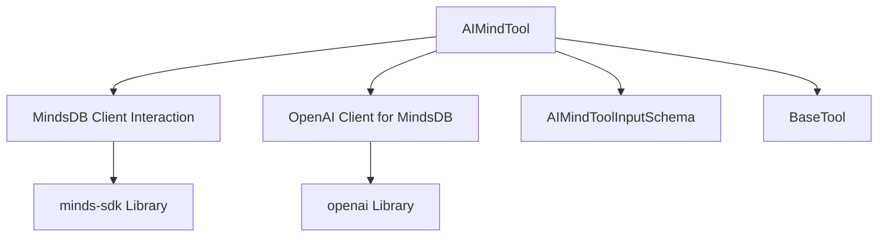

# ai_mind_tool_module

## Introduction
The `ai_mind_tool_module` provides the `AIMindTool`, a specialized tool designed to integrate CrewAI agents with AI-Minds (MindsDB). This tool enables agents to query various data sources, including PostgreSQL, MySQL, MariaDB, ClickHouse, Snowflake, and Google BigQuery, by formulating natural language questions. It acts as a bridge, allowing CrewAI agents to leverage the powerful data querying capabilities of AI-Minds for informed decision-making and task execution.

## Core Functionality: AIMindTool

The `AIMindTool` is the primary component of this module, encapsulating the logic for connecting to AI-Minds, configuring data sources, creating an AI-Mind instance, and executing queries.

### Purpose and Capabilities
*   **Natural Language Queries**: Allows agents to ask questions about data in natural language.
*   **Multi-Database Support**: Connects to a wide array of relational databases and data warehouses via AI-Minds.
*   **Dynamic AI-Mind Creation**: Automatically sets up a dedicated AI-Mind instance with specified data sources upon initialization.
*   **OpenAI API Compatibility**: Utilizes the OpenAI client for interacting with the AI-Minds API, simplifying integration.

### Architecture and Component Relationships

The `AIMindTool` inherits from `BaseTool` (from [crewai_tool_base.md](crewai_tool_base.md)), adhering to the standard tool interface within CrewAI. It orchestrates interactions with the `minds-sdk` for AI-Mind management and leverages the `openai` library for query execution against the AI-Minds' OpenAI-compatible API.

<!-- DIAGRAM_JSON
{
    "direction": "TD",
    "nodes": [
        {"id": "ai_mind_tool", "label": "AIMindTool", "type": "component", "link": null},
        {"id": "minds_client", "label": "MindsDB Client Interaction", "type": "component", "link": null},
        {"id": "openai_client", "label": "OpenAI Client for MindsDB", "type": "component", "link": null},
        {"id": "ai_mind_tool_input_schema", "label": "AIMindToolInputSchema", "type": "component", "link": null},
        {"id": "base_tool", "label": "BaseTool", "type": "external", "link": "crewai_tool_base.md"},
        {"id": "minds_sdk", "label": "minds-sdk Library", "type": "external", "link": null},
        {"id": "openai_library", "label": "openai Library", "type": "external", "link": null}
    ],
    "edges": [
        {"source": "ai_mind_tool", "target": "base_tool"},
        {"source": "ai_mind_tool", "target": "ai_mind_tool_input_schema"},
        {"source": "ai_mind_tool", "target": "minds_client"},
        {"source": "ai_mind_tool", "target": "openai_client"},
        {"source": "minds_client", "target": "minds_sdk"},
        {"source": "openai_client", "target": "openai_library"}
    ],
    "groups": []
}
-->

### Component Details

#### AIMindTool Class

*   **Description**: A wrapper around AI-Minds for querying data sources.
*   **Attributes**:
    *   `name` (str): Defaults to "AIMind Tool".
    *   `description` (str): Explains the tool's utility and supported data sources.
    *   `args_schema` (type[BaseModel]): Defines the expected input schema for the tool, typically a natural language question.
    *   `api_key` (str | None): AI-Minds API key. Can be provided during instantiation or via the `MINDS_API_KEY` environment variable.
    *   `datasources` (list[dict[str, Any]]): A list of dictionaries, each describing a data source to be connected to the AI-Mind. Each dictionary should contain `engine`, `description`, `connection_data`, and `tables`.
    *   `mind_name` (str | None): The name of the AI-Mind instance created by the tool.
    *   `package_dependencies` (list[str]): Specifies `minds-sdk` as a required dependency.
    *   `env_vars` (list[EnvVar]): Declares `MINDS_API_KEY` as a required environment variable.

*   **Initialization (`__init__`)**:
    *   Validates the presence of `api_key`.
    *   Imports necessary classes from `minds-sdk`.
    *   Initializes a `minds.client.Client` instance.
    *   Converts provided `datasources` into `DatabaseConfig` objects.
    *   Creates an AI-Mind instance in MindsDB using `minds_client.minds.create`, assigning a unique name.

*   **Execution (`_run`)**:
    *   Takes a `query` string (the natural language question) as input.
    *   Initializes an `OpenAI` client pointing to the `MINDS_API_BASE_URL`.
    *   Sends the `query` to the configured AI-Mind (using `mind_name` as the model) through the OpenAI-compatible API.
    *   Extracts and returns the content of the AI-Mind's response.

### How it Fits into the Overall System

The `ai_mind_tool_module` is a crucial part of the `crewai_tools_ai_model_tools` sub-module within the broader CrewAI framework. It extends the capabilities of CrewAI agents by allowing them to directly interact with structured and unstructured data stored in various databases through the intelligent interface of AI-Minds. This integration empowers agents to perform data analysis, retrieval, and synthesis as part of complex workflows, enhancing their decision-making and problem-solving abilities within a crew. It provides a powerful mechanism for agents to access and interpret real-world data, making them more versatile and effective.