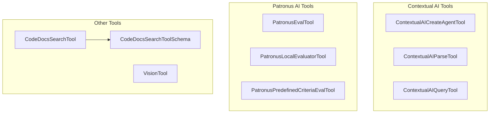

# ai_observability_and_context
This module provides a collection of AI-powered tools for various tasks, including code documentation search, Contextual AI agent management and parsing, Patronus AI evaluation, and OpenAI Vision capabilities. It integrates with external AI services to extend agent functionalities.

<!-- DIAGRAM_JSON
{
  "nodes": [
    {"id": "CodeDocsSearchTool", "label": "CodeDocsSearchTool"},
    {"id": "CodeDocsSearchToolSchema", "label": "CodeDocsSearchToolSchema"},
    {"id": "ContextualAICreateAgentTool", "label": "ContextualAICreateAgentTool"},
    {"id": "ContextualAIParseTool", "label": "ContextualAIParseTool"},
    {"id": "ContextualAIQueryTool", "label": "ContextualAIQueryTool"},
    {"id": "PatronusEvalTool", "label": "PatronusEvalTool"},
    {"id": "PatronusLocalEvaluatorTool", "label": "PatronusLocalEvaluatorTool"},
    {"id": "PatronusPredefinedCriteriaEvalTool", "label": "PatronusPredefinedCriteriaEvalTool"},
    {"id": "VisionTool", "label": "VisionTool"}
  ],
  "edges": [
    {"source": "CodeDocsSearchTool", "target": "CodeDocsSearchToolSchema", "label": "uses"}
  ],
  "groups": [
    {"id": "ContextualAITools", "label": "Contextual AI Tools", "nodes": ["ContextualAICreateAgentTool", "ContextualAIParseTool", "ContextualAIQueryTool"]},
    {"id": "PatronusAITools", "label": "Patronus AI Tools", "nodes": ["PatronusEvalTool", "PatronusLocalEvaluatorTool", "PatronusPredefinedCriteriaEvalTool"]},
    {"id": "OtherTools", "label": "Other Tools", "nodes": ["CodeDocsSearchTool", "CodeDocsSearchToolSchema", "VisionTool"]}
  ]
}
-->
