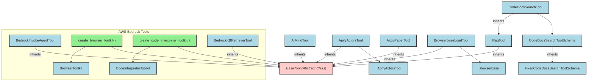

# ai_service_tools
A collection of 35 AI-powered tools for various services, including AWS Bedrock, AI-Minds, Apify, Arxiv, Browserbase, and code documentation search.

<!-- DIAGRAM_JSON
{
    "nodes": [
        {
            "id": "BIT",
            "label": "BedrockInvokeAgentTool",
            "type": "Class"
        },
        {
            "id": "CBT",
            "label": "create_browser_toolkit",
            "type": "Function"
        },
        {
            "id": "CCIT",
            "label": "create_code_interpreter_toolkit",
            "type": "Function"
        },
        {
            "id": "BKBRT",
            "label": "BedrockKBRetrieverTool",
            "type": "Class"
        },
        {
            "id": "AMT",
            "label": "AIMindTool",
            "type": "Class"
        },
        {
            "id": "AAT",
            "label": "ApifyActorsTool",
            "type": "Class"
        },
        {
            "id": "APT",
            "label": "ArxivPaperTool",
            "type": "Class"
        },
        {
            "id": "BBLT",
            "label": "BrowserbaseLoadTool",
            "type": "Class"
        },
        {
            "id": "CDST",
            "label": "CodeDocsSearchTool",
            "type": "Class"
        },
        {
            "id": "CDSTS",
            "label": "CodeDocsSearchToolSchema",
            "type": "Class"
        },
        {
            "id": "BT",
            "label": "BaseTool",
            "type": "Abstract Class"
        },
        {
            "id": "BToolkit",
            "label": "BrowserToolkit",
            "type": "Class"
        },
        {
            "id": "CIToolkit",
            "label": "CodeInterpreterToolkit",
            "type": "Class"
        },
        {
            "id": "RagT",
            "label": "RagTool",
            "type": "Class"
        },
        {
            "id": "FCDSTS",
            "label": "FixedCodeDocsSearchToolSchema",
            "type": "Class"
        },
        {
            "id": "_AAT",
            "label": "_ApifyActorsTool",
            "type": "Class"
        },
        {
            "id": "BB",
            "label": "Browserbase",
            "type": "Class"
        }
    ],
    "edges": [
        {
            "source": "BIT",
            "target": "BT",
            "type": "inherits"
        },
        {
            "source": "CBT",
            "target": "BToolkit",
            "type": "creates"
        },
        {
            "source": "CBT",
            "target": "BT",
            "type": "returns_list_of"
        },
        {
            "source": "CCIT",
            "target": "CIToolkit",
            "type": "creates"
        },
        {
            "source": "CCIT",
            "target": "BT",
            "type": "returns_list_of"
        },
        {
            "source": "BKBRT",
            "target": "BT",
            "type": "inherits"
        },
        {
            "source": "AMT",
            "target": "BT",
            "type": "inherits"
        },
        {
            "source": "AAT",
            "target": "BT",
            "type": "inherits"
        },
        {
            "source": "AAT",
            "target": "_AAT",
            "type": "uses"
        },
        {
            "source": "APT",
            "target": "BT",
            "type": "inherits"
        },
        {
            "source": "BBLT",
            "target": "BT",
            "type": "inherits"
        },
        {
            "source": "BBLT",
            "target": "BB",
            "type": "uses"
        },
        {
            "source": "CDST",
            "target": "RagT",
            "type": "inherits"
        },
        {
            "source": "CDST",
            "target": "CDSTS",
            "type": "uses_schema"
        },
        {
            "source": "CDSTS",
            "target": "FCDSTS",
            "type": "inherits"
        },
        {
            "source": "RagT",
            "target": "BT",
            "type": "inherits"
        }
    ],
    "groups": [
        {
            "id": "aws_bedrock",
            "label": "AWS Bedrock Tools",
            "nodes": [
                "BIT",
                "CBT",
                "CCIT",
                "BKBRT",
                "BToolkit",
                "CIToolkit"
            ]
        }
    ]
}
-->
```
