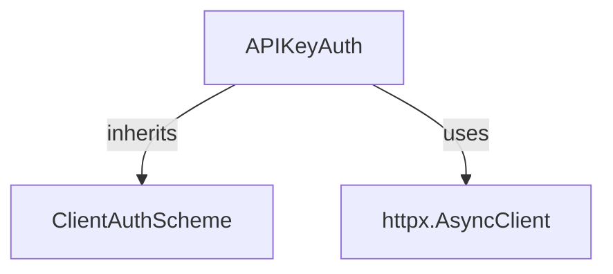

# api_key_authentication Module

## Introduction
The `api_key_authentication` module provides a robust mechanism for authenticating client-side HTTP requests using API keys. This module is an integral part of the client authentication schemes within the `crewai_agent_to_agent_communication` system, enabling secure interactions with services that require API key-based validation.

## Architecture and Core Components

The `api_key_authentication` module primarily consists of the `APIKeyAuth` class, which extends the `ClientAuthScheme` to implement various API key application methods.

### `APIKeyAuth` Class
The `APIKeyAuth` class is responsible for encapsulating the logic for applying an API key to outgoing HTTP requests. It supports flexible configuration for where the API key should be placed:
- **Header:** The API key is sent as an HTTP header.
- **Query Parameter:** The API key is appended as a query parameter to the request URL.
- **Cookie:** The API key is set as a cookie in the request.

#### Key Features:
- **Flexible Location:** Allows specifying the API key location as `header`, `query`, or `cookie`.
- **Customizable Name:** Supports custom parameter names for the API key (defaulting to `X-API-Key`).
- **Idempotent Client Configuration:** Ensures that `httpx.AsyncClient` instances are configured with the query parameter hook only once, preventing unintended side effects.

#### Component Relationships:
- **Inheritance:** `APIKeyAuth` inherits from `ClientAuthScheme`, establishing it as a specific type of client authentication.
- **HTTP Client Interaction:** It directly interacts with `httpx.AsyncClient` to modify request headers or URLs based on the configured API key location.

## Module Integration

This module plays a crucial role within the broader [a2a_auth_schemes](a2a_auth_schemes.md) by offering a concrete implementation for API key-based client authentication. It enables agents to securely communicate with various services by handling the specifics of API key inclusion in requests. Its integration ensures that outbound requests from CrewAI agents can be properly authenticated with external APIs or services that rely on API keys.

<!-- DIAGRAM_JSON
{
    "direction": "TD",
    "nodes": [
        {"id": "api_key_auth", "label": "APIKeyAuth", "type": "component", "link": null},
        {"id": "client_auth_scheme", "label": "ClientAuthScheme", "type": "external", "link": "base_client_auth_scheme.md"},
        {"id": "httpx_async_client", "label": "httpx.AsyncClient", "type": "external", "link": null}
    ],
    "edges": [
        {"source": "api_key_auth", "target": "client_auth_scheme", "label": "inherits"},
        {"source": "api_key_auth", "target": "httpx_async_client", "label": "uses"}
    ],
    "groups": []
}
-->

