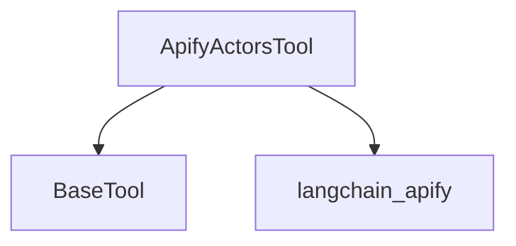

# `apify_actors_tool`

## Introduction

The `apify_actors_tool` module provides the `ApifyActorsTool`, a specialized tool designed to interact with and execute Apify Actors directly from within a CrewAI application. This integration allows agents to leverage the vast array of web scraping, data extraction, and automation capabilities offered by the Apify platform.

## Architecture and Component Relationships

The `apify_actors_tool` module is a leaf module within the `crewai_tools_platform_automation` family, focusing solely on the `ApifyActorsTool` class. It extends the `BaseTool` from the [crewai_tool_base](crewai_tool_base.md) module and relies on the `langchain_apify` library to facilitate communication with the Apify platform.

<!-- DIAGRAM_JSON
{
    "direction": "TD",
    "nodes": [
        {"id": "apify_actors_tool", "label": "ApifyActorsTool", "type": "component", "link": null},
        {"id": "base_tool", "label": "BaseTool", "type": "external", "link": "crewai_tool_base.md"},
        {"id": "langchain_apify", "label": "langchain_apify", "type": "external", "link": null}
    ],
    "edges": [
        {"source": "apify_actors_tool", "target": "base_tool"},
        {"source": "apify_actors_tool", "target": "langchain_apify"}
    ],
    "groups": []
}
-->


## Core Functionality

### `ApifyActorsTool`

`lib.crewai-tools.src.crewai_tools.tools.apify_actors_tool.apify_actors_tool.ApifyActorsTool`

This class serves as a wrapper for running Apify Actors. It simplifies the process of integrating Apify's powerful web automation capabilities into CrewAI agents.

**Key Features:**

*   **Actor Execution:** Enables the execution of any specified Apify Actor by its name.
*   **Environment Variable Dependency:** Requires the `APIFY_API_TOKEN` environment variable to be set for authentication with the Apify platform.
*   **Package Dependency:** Automatically checks for the `langchain_apify` Python package and guides the user to install it if missing.
*   **Error Handling:** Provides clear error messages for missing API tokens or package installations, and catches runtime errors during Actor execution.
*   **Results Handling:** Returns the results from the executed Apify Actor in a structured format (list of dictionaries).

**Initialization (`__init__`)**

When initializing `ApifyActorsTool`:

1.  It verifies the presence of the `APIFY_API_TOKEN` environment variable. If missing, a `ValueError` is raised.
2.  It attempts to import `langchain_apify`. If the package is not found, an `ImportError` is raised with installation instructions.
3.  It instantiates an internal `_ApifyActorsTool` object from `langchain_apify`, passing the `actor_name`.
4.  It populates the tool's `name`, `description`, and `args_schema` based on the internal `_ApifyActorsTool`.

**`_run` Method**

```python
def _run(self, run_input: dict[str, Any]) -> list[dict[str, Any]]:
    """Run the Actor tool with the given input.

    Returns:
        List[Dict[str, Any]]: Results from the Actor execution.

    Raises:
        ValueError: If 'actor_tool' is not initialized.
    """
    try:
        return self.actor_tool._run(run_input)
    except Exception as e:
        msg = (
            f"Failed to run ApifyActorsTool {self.name}. "
            "Please check your Apify account Actor run logs for more details."
            f"Error: {e}"
        )
        raise RuntimeError(msg) from e
```

The `_run` method is responsible for executing the underlying `langchain_apify` Actor tool with the provided `run_input`. It wraps the execution in a `try-except` block to catch any exceptions during the Actor run and provides a more informative `RuntimeError`.

**Usage Example:**

```python
from crewai_tools import ApifyActorsTool

tool = ApifyActorsTool(actor_name="apify/rag-web-browser")

results = tool.run(run_input={"query": "What is CrewAI?", "maxResults": 5})
for result in results:
    print(f"URL: {result['metadata']['url']}")
    print(f"Content: {result.get('markdown', 'N/A')[:100]}...")
```
