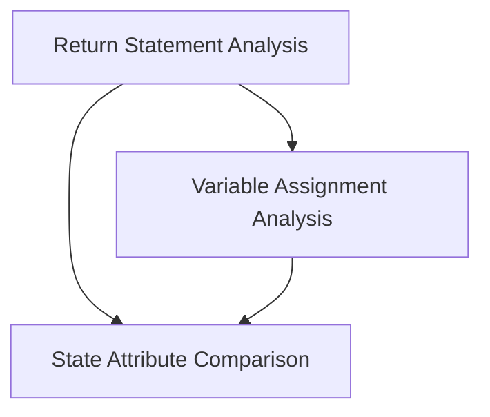

# `ast_visitors` Module Documentation

## Introduction and Purpose
The `ast_visitors` module provides a set of Abstract Syntax Tree (AST) visitors designed for static analysis of Python code within the `crewai.flow.utils` context. These visitors are crucial for extracting specific information from the AST, such as return values, variable assignments, and state attribute comparisons, which aids in understanding and analyzing the control flow and data dependencies within the system.

## Architecture Overview
The module is structured around specialized `ast.NodeVisitor` subclasses, each focusing on a distinct aspect of AST traversal and data extraction. This modular approach allows for precise and efficient analysis of different code constructs, facilitating the identification of key patterns and values without executing the code. Each visitor operates independently but contributes to a comprehensive understanding of the code's structure and behavior.

<!-- DIAGRAM_JSON
{
    "direction": "TD",
    "nodes": [
        {"id": "return_visitor_module", "label": "Return Statement Analysis", "type": "module", "link": "return_visitor_module.md"},
        {"id": "variable_assignment_visitor_module", "label": "Variable Assignment Analysis", "type": "module", "link": "variable_assignment_visitor_module.md"},
        {"id": "state_attribute_visitor_module", "label": "State Attribute Comparison", "type": "module", "link": "state_attribute_visitor_module.md"}
    ],
    "edges": [
        {"source": "return_visitor_module", "target": "variable_assignment_visitor_module"},
        {"source": "return_visitor_module", "target": "state_attribute_visitor_module"},
        {"source": "variable_assignment_visitor_module", "target": "state_attribute_visitor_module"}
    ],
    "groups": []
}
-->

## High-Level Functionality
This module comprises several sub-modules, each dedicated to a specific aspect of AST analysis:

*   **[Return Statement Analysis](return_visitor_module.md)**: This sub-module focuses on parsing and extracting values from `return` statements within the AST. It identifies constant string returns, values from dictionary lookups, and dynamically assigned variable or state attribute values that are being returned.

*   **[Variable Assignment Analysis](variable_assignment_visitor_module.md)**: This sub-module is responsible for analyzing `ast.Assign` nodes to detect variable assignments. It specifically extracts string constants assigned to variables and captures dictionary literal definitions, which are then used to infer possible return values or state changes.

*   **[State Attribute Comparison](state_attribute_visitor_module.md)**: This sub-module is designed to identify and extract string values used in comparison operations involving `self.state` attributes. It helps in understanding the conditions under which different code paths might be taken based on the system's internal state.