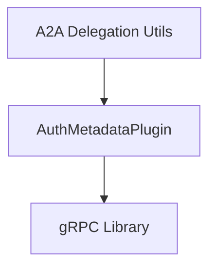

# auth_metadata_plugin

## Introduction

The `auth_metadata_plugin` module provides a specialized gRPC authentication metadata plugin crucial for securing inter-agent communication within the CrewAI framework. It facilitates the injection of authentication headers as metadata into gRPC requests, enabling robust and flexible authentication mechanisms for delegated tasks.

## Architecture and Core Components

This module primarily consists of the `AuthMetadataPlugin` class, which extends gRPC's `AuthMetadataPlugin`. It operates by intercepting gRPC calls and attaching predefined authentication metadata. This ensures that all outgoing gRPC communications from an agent carry the necessary authentication context.

### Component: `AuthMetadataPlugin`

`AuthMetadataPlugin` is a concrete implementation of `grpc.AuthMetadataPlugin`. It's initialized with a list of key-value pairs representing authentication metadata (e.g., API keys, tokens) that will be appended to every gRPC request initiated by the plugin.

**Purpose:** To programmatically inject authentication metadata into gRPC request headers, supporting delegated authentication scenarios in CrewAI's Agent-to-Agent (A2A) communication.

**Key Functionality:**

*   **Initialization (`__init__`):** Stores the provided metadata as a tuple.
*   **Call Method (`__call__`):** This method is invoked by the gRPC framework to retrieve metadata. It returns the pre-configured authentication metadata, which is then added to the gRPC request.

## Module Integration

The `auth_metadata_plugin` module is an integral part of the [a2a_delegation_utils](a2a_delegation_utils.md) module, specifically within its gRPC interception mechanisms. It works in conjunction with other gRPC interceptors to construct a secure and authenticated communication channel between agents. It leverages the core gRPC library to integrate seamlessly into the communication flow.

<!-- DIAGRAM_JSON
{
    "direction": "TD",
    "nodes": [
        {"id": "auth_metadata_plugin_class", "label": "AuthMetadataPlugin", "type": "component", "link": null},
        {"id": "grpc_library", "label": "gRPC Library", "type": "external", "link": null},
        {"id": "a2a_delegation_utils", "label": "A2A Delegation Utils", "type": "external", "link": "a2a_delegation_utils.md"}
    ],
    "edges": [
        {"source": "auth_metadata_plugin_class", "target": "grpc_library"},
        {"source": "a2a_delegation_utils", "target": "auth_metadata_plugin_class"}
    ],
    "groups": []
}
-->
