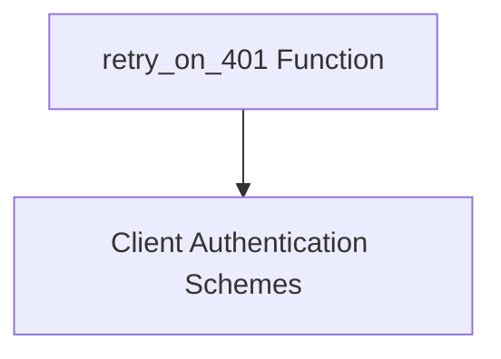

# auth_utils Module Documentation

## Introduction
The `auth_utils` module provides essential utility functions for handling authentication-related tasks within the CrewAI Agent-to-Agent (A2A) communication framework. Its primary function is to manage automatic retries for HTTP requests that fail due to 401 Unauthorized errors, by attempting to refresh authentication credentials.

## Architecture and Component Relationships

The `auth_utils` module contains the `retry_on_401` function, which is crucial for robust A2A communication. This function interacts with client authentication schemes to re-authenticate and retry requests seamlessly.

<!-- DIAGRAM_JSON
{
    "direction": "TD",
    "nodes": [
        {"id": "retry_on_401", "label": "retry_on_401 Function", "type": "component", "link": null},
        {"id": "client_auth_schemes", "label": "Client Authentication Schemes", "type": "external", "link": "client_auth_schemes.md"}
    ],
    "edges": [
        {"source": "retry_on_401", "target": "client_auth_schemes"}
    ],
    "groups": []
}
-->

## How the Module Fits into the Overall System
The `auth_utils` module is a core part of the `crewai_agent_to_agent_communication` system, specifically within the `a2a_auth_schemes` sub-module. It ensures the reliability of agent-to-agent interactions by gracefully handling authentication failures. By automatically attempting to refresh tokens and retry requests, it minimizes disruptions and enhances the overall stability of the A2A communication. It relies on the various client authentication schemes defined in the [client_auth_schemes](client_auth_schemes.md) module to perform re-authentication.

## Core Components

### `retry_on_401`
This asynchronous function is designed to handle HTTP 401 Unauthorized responses by attempting to refresh authentication credentials and retrying the original request. It parses `WWW-Authenticate` headers to understand the authentication challenges and then uses the provided `ClientAuthScheme` to apply new authentication headers before retrying the request.

**Parameters:**
- `request_func`: An asynchronous callable that performs the original HTTP request.
- `auth_scheme`: An instance of `ClientAuthScheme` (or `None`), used to acquire and apply new authentication credentials.
- `client`: An `httpx.AsyncClient` instance used for making HTTP requests.
- `headers`: A mutable mapping of request headers, which will be updated with new authentication information.
- `max_retries`: The maximum number of times to retry the request (default is 3).

**Returns:**
- The HTTP response from the (potentially retried) request.

**Raises:**
- `httpx.HTTPStatusError`: If `max_retries` are exhausted and the last response was a 401, or if `auth_scheme` is `None` when a 401 is received.
- `RuntimeError`: If the function fails to make any requests, indicating a potential issue with the `request_func` or its setup.
