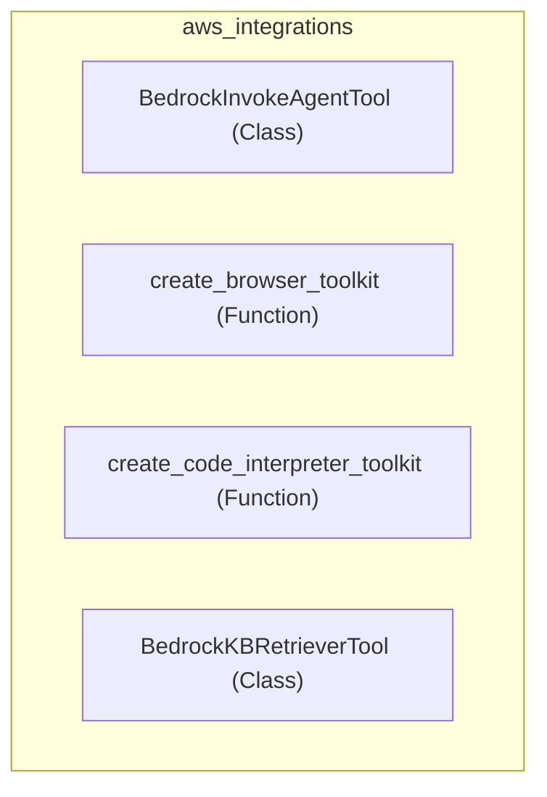

# aws_integrations
This module provides a collection of tools and functions for interacting with various AWS Bedrock services, including agents, knowledge bases, browser interactions, and code interpretation. It offers components to facilitate integration with Bedrock's AI capabilities.

<!-- DIAGRAM_JSON
{
  "nodes": [
    {
      "id": "BedrockInvokeAgentTool",
      "label": "BedrockInvokeAgentTool",
      "type": "Class"
    },
    {
      "id": "create_browser_toolkit",
      "label": "create_browser_toolkit",
      "type": "Function"
    },
    {
      "id": "create_code_interpreter_toolkit",
      "label": "create_code_interpreter_toolkit",
      "type": "Function"
    },
    {
      "id": "BedrockKBRetrieverTool",
      "label": "BedrockKBRetrieverTool",
      "type": "Class"
    }
  ],
  "edges": [],
  "groups": [
    {
      "id": "aws_integrations",
      "label": "aws_integrations",
      "nodes": [
        "BedrockInvokeAgentTool",
        "create_browser_toolkit",
        "create_code_interpreter_toolkit",
        "BedrockKBRetrieverTool"
      ]
    }
  ]
}
-->
