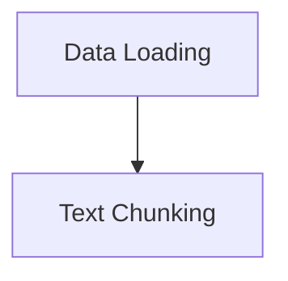

# Base Components Module

## Introduction

The `base_components` module serves as the foundational layer for Retrieval Augmented Generation (RAG) operations within the system. It provides essential abstract classes for handling the ingestion and processing of data, specifically focusing on how content is loaded and subsequently chunked into manageable pieces for further processing by RAG systems.

This module ensures a standardized approach to data preparation, promoting consistency and reusability across different data sources and processing pipelines.

## Architecture Overview

This module is composed of two core functional sub-modules:

*   **Data Loading**: Responsible for defining how various types of content are loaded into the system.
*   **Text Chunking**: Manages the process of splitting loaded content into smaller, semantically coherent chunks.

The relationship between these components is sequential: data is first loaded, and then the loaded content is passed to the chunking mechanism for segmentation.

<!-- DIAGRAM_JSON
{
    "direction": "TD",
    "nodes": [
        {"id": "data_loading", "label": "Data Loading", "type": "module", "link": "data_loading.md"},
        {"id": "text_chunking", "label": "Text Chunking", "type": "module", "link": "text_chunking.md"}
    ],
    "edges": [
        {"source": "data_loading", "target": "text_chunking"}
    ],
    "groups": []
}
-->

## Sub-modules

### [Data Loading](data_loading.md)
This sub-module defines the `BaseLoader` abstract class, which is the cornerstone for all data ingestion mechanisms. It specifies the interface for loading various types of content and includes utilities for generating unique document IDs.

### [Text Chunking](text_chunking.md)
This sub-module introduces the `BaseChunker` class, providing the fundamental functionality for splitting large text documents into smaller, more manageable chunks. This is crucial for optimizing performance and relevance in RAG systems by processing information in discrete units.
