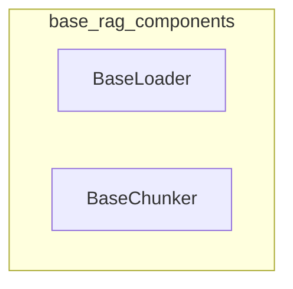

# base_rag_components
This module provides foundational abstract base classes for RAG operations, including `BaseLoader` for content loading and ID generation, and `BaseChunker` for splitting text into manageable pieces.

<!-- DIAGRAM_JSON
{
  "nodes": [
    {
      "id": "BaseLoader",
      "label": "BaseLoader",
      "type": "class"
    },
    {
      "id": "BaseChunker",
      "label": "BaseChunker",
      "type": "class"
    }
  ],
  "edges": [],
  "groups": [
    {
      "id": "base_rag_components",
      "label": "base_rag_components",
      "nodes": ["BaseLoader", "BaseChunker"]
    }
  ]
}
-->
