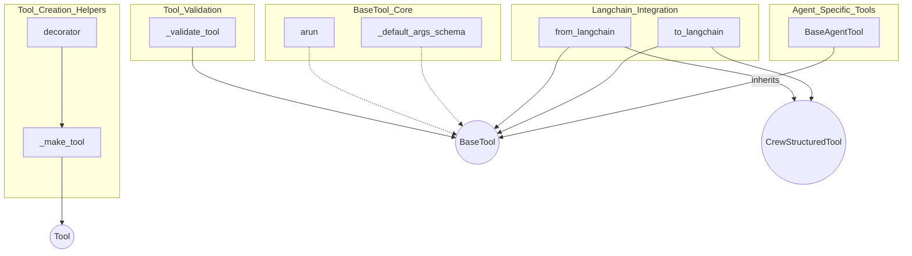

# base_tool_management
This module provides core functionalities for managing and creating various types of tools, including base tool definitions, agent-specific tools, and utilities for integration with Langchain.

<!-- DIAGRAM_JSON
{
    "nodes": [
        {
            "id": "BaseAgentTool",
            "label": "BaseAgentTool",
            "type": "class"
        },
        {
            "id": "to_langchain",
            "label": "to_langchain",
            "type": "function"
        },
        {
            "id": "_default_args_schema",
            "label": "_default_args_schema",
            "type": "method"
        },
        {
            "id": "_make_tool",
            "label": "_make_tool",
            "type": "function"
        },
        {
            "id": "arun",
            "label": "arun",
            "type": "method"
        },
        {
            "id": "_validate_tool",
            "label": "_validate_tool",
            "type": "function"
        },
        {
            "id": "from_langchain",
            "label": "from_langchain",
            "type": "method"
        },
        {
            "id": "decorator",
            "label": "decorator",
            "type": "function"
        },
        {
            "id": "BaseTool",
            "label": "BaseTool",
            "type": "conceptual"
        },
        {
            "id": "CrewStructuredTool",
            "label": "CrewStructuredTool",
            "type": "conceptual"
        },
        {
            "id": "Tool",
            "label": "Tool",
            "type": "conceptual"
        }
    ],
    "edges": [
        {
            "source": "BaseAgentTool",
            "target": "BaseTool",
            "type": "inheritance",
            "label": "inherits"
        },
        {
            "source": "to_langchain",
            "target": "BaseTool",
            "type": "uses",
            "label": "processes"
        },
        {
            "source": "to_langchain",
            "target": "CrewStructuredTool",
            "type": "produces",
            "label": "produces"
        },
        {
            "source": "_default_args_schema",
            "target": "BaseTool",
            "type": "belongs_to",
            "label": "method of"
        },
        {
            "source": "_make_tool",
            "target": "Tool",
            "type": "creates",
            "label": "creates"
        },
        {
            "source": "arun",
            "target": "BaseTool",
            "type": "belongs_to",
            "label": "method of"
        },
        {
            "source": "_validate_tool",
            "target": "BaseTool",
            "type": "uses",
            "label": "validates"
        },
        {
            "source": "from_langchain",
            "target": "CrewStructuredTool",
            "type": "consumes",
            "label": "consumes"
        },
        {
            "source": "from_langchain",
            "target": "BaseTool",
            "type": "produces",
            "label": "produces"
        },
        {
            "source": "decorator",
            "target": "_make_tool",
            "type": "uses",
            "label": "uses"
        }
    ],
    "groups": [
        {
            "id": "BaseTool_Core",
            "label": "BaseTool Core",
            "nodes": [
                "_default_args_schema",
                "arun"
            ]
        },
        {
            "id": "Tool_Creation_Helpers",
            "label": "Tool Creation Helpers",
            "nodes": [
                "_make_tool",
                "decorator"
            ]
        },
        {
            "id": "Tool_Validation",
            "label": "Tool Validation",
            "nodes": [
                "_validate_tool"
            ]
        },
        {
            "id": "Langchain_Integration",
            "label": "Langchain Integration",
            "nodes": [
                "to_langchain",
                "from_langchain"
            ]
        },
        {
            "id": "Agent_Specific_Tools",
            "label": "Agent Specific Tools",
            "nodes": [
                "BaseAgentTool"
            ]
        }
    ]
}
-->
