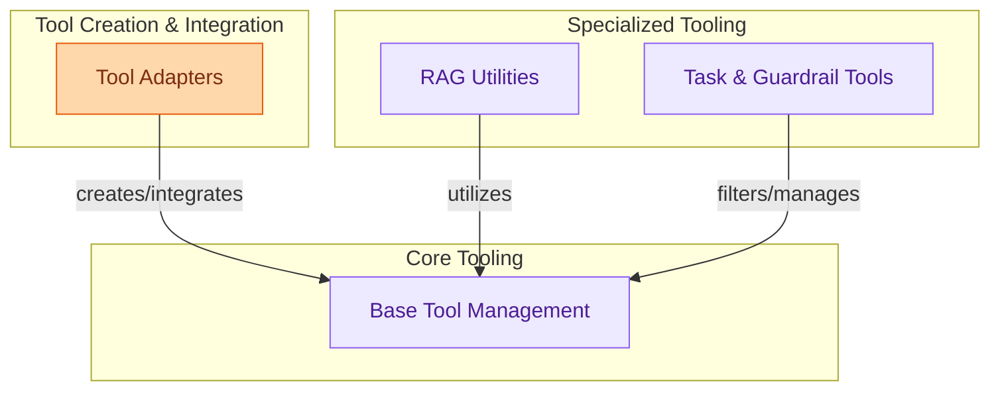

# Base Tooling
This module provides the foundational components for creating, adapting, managing, and executing various tools within the CrewAI framework, enabling agents to interact with external systems and data sources.

<!-- DIAGRAM_JSON
{
    "direction": "TD",
    "nodes": [
        {"id": "tool_adapters", "label": "Tool Adapters", "type": "module", "link": "tool_adapters.md"},
        {"id": "base_tool_management", "label": "Base Tool Management", "type": "module", "link": "base_tool_management.md"},
        {"id": "rag_utilities", "label": "RAG Utilities", "type": "module", "link": "rag_utilities.md"},
        {"id": "task_and_guardrail_tools", "label": "Task & Guardrail Tools", "type": "module", "link": "task_and_guardrail_tools.md"}
    ],
    "edges": [
        {"source": "tool_adapters", "target": "base_tool_management", "label": "creates/integrates"},
        {"source": "rag_utilities", "target": "base_tool_management", "label": "utilizes"},
        {"source": "task_and_guardrail_tools", "target": "base_tool_management", "label": "filters/manages"}
    ],
    "groups": [
        {"id": "tool_creation_integration", "label": "Tool Creation & Integration", "role": "generative", "nodes": ["tool_adapters"]},
        {"id": "core_tooling", "label": "Core Tooling", "role": "analytical", "nodes": ["base_tool_management"]},
        {"id": "specialized_tooling", "label": "Specialized Tooling", "role": "analytical", "nodes": ["rag_utilities", "task_and_guardrail_tools"]}
    ]
}
-->
