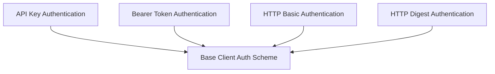

# Basic Client Authentication Module

The `basic_client_auth` module provides a foundational set of client-side authentication schemes for secure communication within the system. It encapsulates various common authentication methods, allowing client applications to interact with authenticated services.

## Architecture Overview

The module is structured into several sub-modules, each dedicated to a specific type of client authentication. These sub-modules inherit from a base client authentication scheme and provide concrete implementations for applying authentication to HTTP requests.

<!-- DIAGRAM_JSON
{
    "direction": "TD",
    "nodes": [
        {"id": "base_client_auth_scheme", "label": "Base Client Auth Scheme", "type": "module", "link": "base_client_auth_scheme.md"},
        {"id": "api_key_authentication", "label": "API Key Authentication", "type": "module", "link": "api_key_authentication.md"},
        {"id": "bearer_token_authentication", "label": "Bearer Token Authentication", "type": "module", "link": "bearer_token_authentication.md"},
        {"id": "http_basic_authentication", "label": "HTTP Basic Authentication", "type": "module", "link": "http_basic_authentication.md"},
        {"id": "http_digest_authentication", "label": "HTTP Digest Authentication", "type": "module", "link": "http_digest_authentication.md"}
    ],
    "edges": [
        {"source": "api_key_authentication", "target": "base_client_auth_scheme"},
        {"source": "bearer_token_authentication", "target": "base_client_auth_scheme"},
        {"source": "http_basic_authentication", "target": "base_client_auth_scheme"},
        {"source": "http_digest_authentication", "target": "base_client_auth_scheme"}
    ],
    "groups": []
}
-->

## Sub-modules

### [API Key Authentication](api_key_authentication.md)
This sub-module implements API key-based client authentication, supporting header, query, or cookie locations for transmitting the API key.

### [Bearer Token Authentication](bearer_token_authentication.md)
This sub-module handles client authentication using Bearer tokens, typically sent in the Authorization header of HTTP requests.

### [HTTP Basic Authentication](http_basic_authentication.md)
This sub-module provides HTTP Basic authentication, encoding the username and password into a Base64 string for the Authorization header.

### [HTTP Digest Authentication](http_digest_authentication.md)
This sub-module implements HTTP Digest authentication, leveraging the `httpx-auth` library for its robust authentication flow.

### [Base Client Auth Scheme](base_client_auth_scheme.md)
This sub-module represents the base class for all client authentication schemes. It defines the interface for applying authentication to HTTP requests. Note: This class is deprecated, and `ClientAuthScheme` should be used instead.