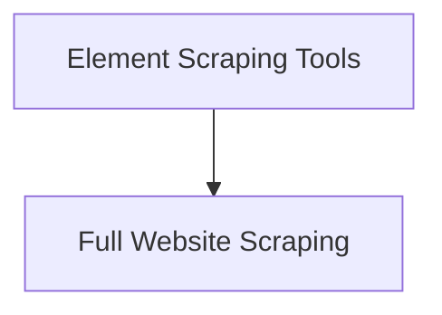

# Basic Web Scraping Module

The `basic_web_scraping` module provides fundamental tools for extracting information from websites, catering to both full-page content retrieval and targeted element scraping using CSS selectors. It serves as a core utility for agents requiring direct interaction with web content.

## Architecture Overview

The module is structured into two main sub-modules, each focusing on a distinct aspect of web scraping:

<!-- DIAGRAM_JSON
{
    "direction": "TD",
    "nodes": [
        {"id": "element_scraping", "label": "Element Scraping Tools", "type": "module", "link": "element_scraping.md"},
        {"id": "full_website_scraping", "label": "Full Website Scraping", "type": "module", "link": "full_website_scraping.md"}
    ],
    "edges": [
        {"source": "element_scraping", "target": "full_website_scraping"}
    ],
    "groups": []
}
-->

## Sub-modules

### [Element Scraping Tools](element_scraping.md)
This sub-module focuses on extracting specific HTML elements from a webpage. It utilizes CSS selectors to pinpoint and retrieve desired content, making it ideal for structured data extraction.

### [Full Website Scraping](full_website_scraping.md)
This sub-module provides functionality to scrape the entire visible text content of a given website. It's useful for general content aggregation and analysis where the full page text is required.