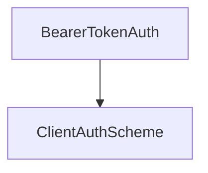

# Bearer Token Authentication Module

The `bearer_token_authentication` module provides a client-side authentication scheme for securing Agent-to-Agent (A2A) communication using Bearer tokens. It includes the `BearerTokenAuth` class, which facilitates the injection of an `Authorization: Bearer <token>` header into HTTP requests.

This module is a critical component for ensuring secure interactions between agents where token-based authentication is required.

## Architecture Diagram
<!-- DIAGRAM_JSON
{
    "direction": "TD",
    "nodes": [
        {"id": "bearer_token_auth", "label": "BearerTokenAuth", "type": "component", "link": null},
        {"id": "client_auth_scheme", "label": "ClientAuthScheme", "type": "external", "link": "client_auth_schemes.md"}
    ],
    "edges": [
        {"source": "bearer_token_auth", "target": "client_auth_scheme"}
    ],
    "groups": []
}
-->


## Core Components

### BearerTokenAuth
`lib.crewai.src.crewai.a2a.auth.client_schemes.BearerTokenAuth`

This class implements the `ClientAuthScheme` interface to provide Bearer token authentication. It is responsible for adding the `Authorization` header with the specified Bearer token to outgoing HTTP requests.

**Attributes**:
*   `token`: A string representing the Bearer token used for authentication.

**Methods**:

#### `apply_auth(self, client: httpx.AsyncClient, headers: MutableMapping[str, str]) -> MutableMapping[str, str]`

Asynchronously applies the Bearer token to the `Authorization` header of an HTTP request.

*   **Parameters**:
    *   `client` (`httpx.AsyncClient`): The HTTP client making the request. (Note: The `client` parameter is available but not directly used in the current implementation for token application, as the token is directly added to headers).
    *   `headers` (`MutableMapping[str, str]`): The current request headers.

*   **Returns**:
    *   `MutableMapping[str, str]`: The updated headers with the Bearer token included in the `Authorization` header.

**Example Usage**:

```python
import httpx
from crewai.a2a.auth.client_schemes import BearerTokenAuth

async def make_authenticated_request(token: str):
    auth_scheme = BearerTokenAuth(token=token)
    async with httpx.AsyncClient() as client:
        headers = {}
        updated_headers = await auth_scheme.apply_auth(client, headers)
        print(f"Updated Headers: {updated_headers}")
        # Example of how it would be used in a real request:
        # response = await client.get("https://api.example.com/data", headers=updated_headers)
        # print(response.status_code)

# await make_authenticated_request("your_super_secret_bearer_token")
```

## Integration with the Overall System

The `bearer_token_authentication` module is a fundamental part of the [a2a_auth_schemes](a2a_auth_schemes.md) within the larger [crewai_agent_to_agent_communication](crewai_agent_to_agent_communication.md) system. It ensures that agents can securely communicate by authenticating requests with a Bearer token.

Specifically, it's used by client agents when they need to make requests to other services or agents that require this form of authentication. By conforming to the `ClientAuthScheme` interface, `BearerTokenAuth` can be seamlessly integrated into various client authentication flows managed by the A2A communication layer.