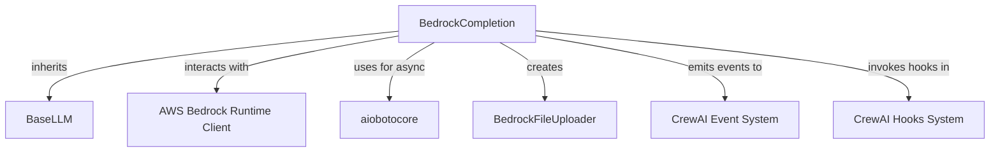

# bedrock_completion Module Documentation

## Introduction

The `bedrock_completion` module provides a native implementation for interacting with AWS Bedrock's Converse API. It offers a comprehensive solution for large language model (LLM) completions, including full tool calling support, streaming capabilities, and robust error handling. This module aims to provide a unified and efficient interface for integrating AWS Bedrock models into applications, adhering to best practices for the Converse API.

## Purpose and Core Functionality

The primary purpose of the `BedrockCompletion` class within this module is to serve as a specialized LLM provider for AWS Bedrock. It extends the `BaseLLM` and implements all necessary functionalities to communicate with Bedrock models via the Converse API. Key features include:

*   **Tool Calling:** Seamlessly supports tool use, including tracking tool call IDs for multi-turn conversations and formatting tool definitions for the Converse API.
*   **Streaming and Non-Streaming Responses:** Handles both real-time streaming and standard non-streaming responses, providing detailed event handling for each.
*   **Guardrail Configuration:** Allows for the configuration of content filtering using Bedrock's guardrail capabilities.
*   **Model-Specific Parameters:** Supports `additionalModelRequestFields` for custom model parameters and `additionalModelResponseFieldPaths` for extracting specific fields from the response.
*   **Structured Output:** Integrates with Pydantic models for structured output, enabling agents to produce responses in a predefined format.
*   **Error Handling:** Implements comprehensive error handling for various AWS exception types, including `ClientError` and `BotoCoreError`.
*   **Token Usage Tracking:** Tracks token usage (input, output, and total tokens) and logs stop reasons for better observability.
*   **Multimodal Support:** Provides mechanisms to check for and handle multimodal inputs, including specific support for Amazon Nova models that can process S3 links for multimedia.
*   **Asynchronous Operations:** Offers asynchronous versions of its core `call` method (`acall`) for non-blocking operations, leveraging `aiobotocore`.

### Core Components

The `bedrock_completion` module is centered around the `BedrockCompletion` class:

*   **`BedrockCompletion`**: Inherits from [llm_base.md](llm_base.md)'s `BaseLLM` and provides the core logic for Bedrock API interactions. It manages client initialization, message formatting, API calls (sync and async), and response parsing. It includes methods for:
    *   `call` and `acall`: The main entry points for making synchronous and asynchronous LLM calls.
    *   `_normalize_bedrock_fields`: A Pydantic model validator that normalizes configuration fields, sets the provider, resolves environment variables for AWS credentials, and identifies Claude models.
    *   `_init_clients`: Initializes the `boto3` Bedrock runtime client for synchronous operations and an `aiobotocore` client for asynchronous operations.
    *   `_handle_converse` and `_ahandle_converse`: Private methods for handling synchronous and asynchronous non-streaming Bedrock API calls, respectively, including tool execution and structured output processing.
    *   `_handle_streaming_converse` and `_ahandle_streaming_converse`: Private methods for managing synchronous and asynchronous streaming responses, parsing events, and handling intermediate tool calls.
    *   `_format_messages_for_converse`: Transforms internal `LLMMessage` objects into the Bedrock Converse API's expected message format, including handling system messages and tool calls.
    *   `_format_tools_for_converse`: Converts CrewAI tool definitions into the `ConverseToolTypeDef` format required by Bedrock.
    *   `get_file_uploader`: Provides a utility to get a `BedrockFileUploader` instance (from `crewai_files_uploaders.md`) configured with the LLM's AWS credentials for handling file uploads, especially for multimodal inputs.
    *   `supports_function_calling`, `supports_stop_words`, `get_context_window_size`, `supports_multimodal`: Methods to query the model's capabilities.

## Architecture and Component Relationships

The `BedrockCompletion` module integrates several components to provide its functionality:

<!-- DIAGRAM_JSON
{
    "direction": "TD",
    "nodes": [
        {"id": "bedrock_completion", "label": "BedrockCompletion", "type": "component", "link": null},
        {"id": "base_llm", "label": "BaseLLM", "type": "external", "link": "llm_base.md"},
        {"id": "aws_bedrock_runtime", "label": "AWS Bedrock Runtime Client", "type": "external", "link": null},
        {"id": "aiobotocore", "label": "aiobotocore", "type": "external", "link": null},
        {"id": "bedrock_file_uploader", "label": "BedrockFileUploader", "type": "external", "link": "crewai_files_uploaders.md"},
        {"id": "event_system", "label": "CrewAI Event System", "type": "external", "link": "crewai_event_system.md"},
        {"id": "hooks_system", "label": "CrewAI Hooks System", "type": "external", "link": "crewai_hooks_system.md"}
    ],
    "edges": [
        {"source": "bedrock_completion", "target": "base_llm", "label": "inherits"},
        {"source": "bedrock_completion", "target": "aws_bedrock_runtime", "label": "interacts with"},
        {"source": "bedrock_completion", "target": "aiobotocore", "label": "uses for async"},
        {"source": "bedrock_completion", "target": "bedrock_file_uploader", "label": "creates"},
        {"source": "bedrock_completion", "target": "event_system", "label": "emits events to"},
        {"source": "bedrock_completion", "target": "hooks_system", "label": "invokes hooks in"}
    ],
    "groups": []
}
-->

**Relationships:**

*   **Inheritance from `BaseLLM`**: `BedrockCompletion` extends the core LLM functionalities provided by `BaseLLM`, ensuring a consistent interface across different LLM providers.
*   **AWS Bedrock Runtime Client**: This is the direct interface for sending requests to the AWS Bedrock Converse API. `BedrockCompletion` manages the lifecycle and configuration of this client.
*   **`aiobotocore`**: For asynchronous operations, `aiobotocore` provides the necessary async client for non-blocking calls to Bedrock.
*   **`BedrockFileUploader`**: When multimodal capabilities are required, `BedrockCompletion` can instantiate a `BedrockFileUploader` to assist in managing file uploads to S3, which is necessary for Bedrock models supporting S3 references.
*   **CrewAI Event System**: The `BedrockCompletion` class emits various events (e.g., call started, call completed, stream chunks) to the central [crewai_event_system.md](crewai_event_system.md) for tracing, logging, and other event-driven functionalities.
*   **CrewAI Hooks System**: `BedrockCompletion` integrates with the [crewai_hooks_system.md](crewai_hooks_system.md) by invoking `before_llm_call` and `after_llm_call` hooks, allowing external logic to intercept and modify LLM interactions.

## How the Module Fits into the Overall System

`bedrock_completion` is a critical part of the [crewai_llm_integrations.md](crewai_llm_integrations.md) ecosystem. It provides the specific implementation for interacting with AWS Bedrock, making Bedrock models available for agents and tasks within CrewAI. By conforming to the `BaseLLM` interface, it seamlessly integrates with the broader CrewAI framework, allowing agents to leverage Bedrock's advanced generative AI capabilities, including its robust tool-use and streaming features.

This module abstracts away the complexities of the Bedrock Converse API, providing a clean and consistent way for CrewAI components to utilize Bedrock models. Its support for structured output and multimodal inputs makes it highly versatile for various agentic workflows.
