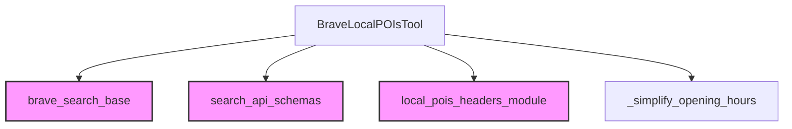

# brave_local_pois_tool Module Documentation

The `brave_local_pois_tool` module provides a specialized tool for retrieving Points of Interest (POIs) using the Brave Search API. This documentation details its purpose, core functionality, architectural relationships, and how it integrates into the broader system.

### Purpose and Core Functionality

The primary purpose of the `brave_local_pois_tool` module is to offer a straightforward interface for accessing local business and geographical information through Brave Search. Its core component, `BraveLocalPOIsTool`, abstracts the complexities of API interaction, allowing other modules or agents to easily query for POIs and receive structured results.

**`BraveLocalPOIsTool`**
This class, inheriting from `BraveSearchToolBase`, is the central component of the module. It is configured to target the Brave Search local POIs endpoint and processes both outgoing requests and incoming responses.

*   **`name`**: "Brave Local POIs" - The identifier for the tool.
*   **`args_schema`**: `LocalPOIsParams` - Defines the expected input parameters for performing a local POI search. This ensures type safety and guides users on what information to provide (e.g., query, location).
*   **`header_schema`**: `LocalPOIsHeaders` - Specifies the necessary headers for the API request, such as authentication tokens.
*   **`description`**: Provides a clear explanation of the tool's capabilities, emphasizing that it returns structured JSON data.
*   **`search_url`**: "https://api.search.brave.com/res/v1/local/pois" - The specific Brave Search API endpoint for local POIs.
*   **`_refine_request_payload(self, params: dict[str, Any]) -> dict[str, Any]`**: A method responsible for pre-processing the input parameters before they are sent to the Brave Search API. In its current form, it returns the parameters as-is, indicating that basic parameter structuring is sufficient.
*   **`_refine_response(self, response: dict[str, Any]) -> list[dict[str, Any]]`**: This method processes the raw JSON response received from the Brave Search API. It extracts relevant fields like title, URL, description, address, contact information, and opening hours, structuring them into a list of dictionaries for easier consumption. It utilizes the `_simplify_opening_hours` helper function to format opening hours consistently.

### Architecture and Component Relationships

The `brave_local_pois_tool` module is a leaf module, focusing on a single, specialized tool. Its architecture primarily revolves around the `BraveLocalPOIsTool` class and its dependencies.

<!-- DIAGRAM_JSON
{
    "direction": "TD",
    "nodes": [
        {"id": "brave_local_pois_tool_class", "label": "BraveLocalPOIsTool", "type": "component", "link": null},
        {"id": "simplify_opening_hours_func", "label": "_simplify_opening_hours", "type": "component", "link": null},
        {"id": "brave_search_base_module", "label": "brave_search_base", "type": "external", "link": "brave_search_base.md"},
        {"id": "search_api_schemas_module", "label": "search_api_schemas", "type": "external", "link": "search_api_schemas.md"},
        {"id": "local_pois_headers_module", "label": "local_pois_headers_module", "type": "external", "link": "local_pois_headers_module.md"}
    ],
    "edges": [
        {"source": "brave_local_pois_tool_class", "target": "brave_search_base_module"},
        {"source": "brave_local_pois_tool_class", "target": "search_api_schemas_module"},
        {"source": "brave_local_pois_tool_class", "target": "local_pois_headers_module"},
        {"source": "brave_local_pois_tool_class", "target": "simplify_opening_hours_func"}
    ],
    "groups": []
}
-->

### How the Module Fits into the Overall System

The `brave_local_pois_tool` module is an integral part of the CrewAI Tools ecosystem, specifically falling under the web search capabilities. It is a sub-module of `brave_search_integration`, which in turn is nested within `crewai_tools_web_search`.

*   **`crewai_tools_web_search`**: This parent module encompasses various tools for web-based information retrieval.
*   **`brave_search_integration`**: This module specifically handles integrations with the Brave Search API, providing a foundational layer for Brave Search-related tools.
*   **`brave_local_pois_tool`**: This module extends the `brave_search_integration` by offering a concrete tool for a highly specific use case: retrieving local Points of Interest.

By providing a dedicated tool for local POIs, this module enables AI agents to perform detailed geographical searches, retrieve business information, and support tasks requiring location-specific data. Its structured output makes it easy for downstream processes to consume and utilize the information effectively. It leverages shared schemas (from [search_api_schemas](search_api_schemas.md) and [local_pois_headers_module](local_pois_headers_module.md)) and a common base for Brave Search tools ([brave_search_base](brave_search_base.md)), ensuring consistency and reusability across the CrewAI framework.