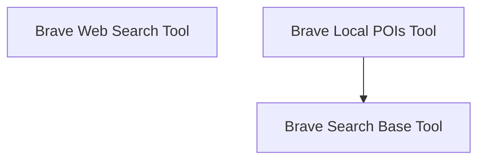

# Brave Search Integration

## Introduction and Purpose
The `brave_search_integration` module provides tools for seamless interaction with the Brave Search API. It offers specialized functionalities for performing general web searches and retrieving local Points of Interest (POIs), all built upon a robust and extensible base for API interaction. This module aims to empower agents with efficient and accurate search capabilities leveraging the Brave Search engine.

## Architecture Overview
The module's architecture is designed to provide a clear separation of concerns, offering a foundational base class for common Brave Search API interactions and distinct, specialized tools for different search types. This structure promotes reusability, maintainability, and extensibility.

<!-- DIAGRAM_JSON
{
    "direction": "TD",
    "nodes": [
        {"id": "brave_search_base", "label": "Brave Search Base Tool", "type": "module", "link": "brave_search_base.md"},
        {"id": "brave_web_search_tool", "label": "Brave Web Search Tool", "type": "module", "link": "brave_web_search_tool.md"},
        {"id": "brave_local_pois_tool", "label": "Brave Local POIs Tool", "type": "module", "link": "brave_local_pois_tool.md"}
    ],
    "edges": [
        {"source": "brave_local_pois_tool", "target": "brave_search_base"}
    ],
    "groups": []
}
-->

## Sub-modules

### Brave Search Base Tool
The `brave_search_base` sub-module ([brave_search_base.md](brave_search_base.md)) provides the abstract base class (`BraveSearchToolBase`) with common functionalities for Brave Search API interaction, including API key management, request validation, rate limiting, and shared request/response processing logic.

### Brave Web Search Tool
The `brave_web_search_tool` sub-module ([brave_web_search_tool.md](brave_web_search_tool.md)) implements the `BraveSearchTool` for performing general web searches using the Brave Search API. It handles specific web search parameters and refines search results for common use cases.

### Brave Local POIs Tool
The `brave_local_pois_tool` sub-module ([brave_local_pois_tool.md](brave_local_pois_tool.md)) offers a specialized tool (`BraveLocalPOIsTool`) built upon `BraveSearchToolBase` for retrieving local Points of Interest (POIs). It includes specific logic for local search parameters and formats POI results.
