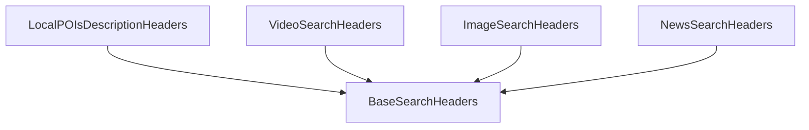

# brave_search_specific_headers Module Documentation

## Introduction

The `brave_search_specific_headers` module is responsible for defining specialized header schemas used when interacting with different Brave Search API endpoints. These headers ensure that requests to specific Brave Search functionalities, such as local points of interest, video, image, and news searches, are properly structured and validated.

## Architecture and Component Relationships

This module contains several Pydantic models that inherit from `BaseSearchHeaders` (defined in the [specialized_search_headers](specialized_search_headers.md) module). Each model represents the required or optional headers for a particular Brave Search endpoint, providing clear data structures for API requests.

<!-- DIAGRAM_JSON
{
    "direction": "TD",
    "nodes": [
        {"id": "local_pois_description_headers", "label": "LocalPOIsDescriptionHeaders", "type": "component", "link": null},
        {"id": "video_search_headers", "label": "VideoSearchHeaders", "type": "component", "link": null},
        {"id": "image_search_headers", "label": "ImageSearchHeaders", "type": "component", "link": null},
        {"id": "news_search_headers", "label": "NewsSearchHeaders", "type": "component", "link": null},
        {"id": "base_search_headers", "label": "BaseSearchHeaders", "type": "external", "link": "specialized_search_headers.md"}
    ],
    "edges": [
        {"source": "local_pois_description_headers", "target": "base_search_headers"},
        {"source": "video_search_headers", "target": "base_search_headers"},
        {"source": "image_search_headers", "target": "base_search_headers"},
        {"source": "news_search_headers", "target": "base_search_headers"}
    ],
    "groups": []
}
-->

### Core Components

*   **`LocalPOIsDescriptionHeaders`**: Defines the specific headers required for making requests to the Brave Search endpoint for local Points of Interest descriptions.

*   **`VideoSearchHeaders`**: Encapsulates the necessary headers for performing video searches through the Brave Search API.

*   **`ImageSearchHeaders`**: Provides the header structure for image search queries using the Brave Search API.

*   **`NewsSearchHeaders`**: Specifies the headers for retrieving news search results from the Brave Search API.

## How the Module Fits into the Overall System

The `brave_search_specific_headers` module is a crucial part of the `crewai_tools_web_search` ecosystem, specifically within the [specialized_search_headers](specialized_search_headers.md) sub-module. It provides the concrete implementations for Brave Search API request headers, allowing the `brave_search_integration` module (within [crewai_tools_web_search](crewai_tools_web_search.md)) to construct well-formed and type-safe API requests for various search types. By centralizing these header definitions, the module promotes consistency, reusability, and maintainability across different Brave Search tool implementations within the CrewAI framework.