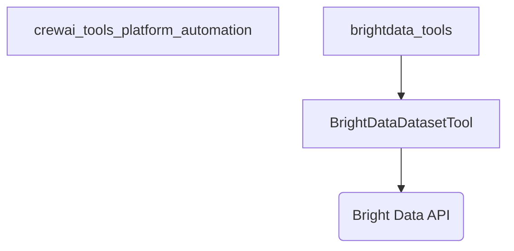

# brightdata_dataset_tool

The `brightdata_dataset_tool` module provides a specialized tool for CrewAI agents to interact with the Bright Data Dataset API. Its primary function is to enable the scraping of structured data from various websites using Bright Data's robust dataset infrastructure, making it easier for agents to gather and process specific web-based information.

## Core Functionality

The core of this module is the `BrightDataDatasetTool` class, a CrewAI-compatible tool designed for efficient and reliable data extraction. This tool leverages the Bright Data platform to perform targeted scraping operations, handling the complexities of API interaction, job triggering, polling for completion, and result retrieval.

### BrightDataDatasetTool

The `BrightDataDatasetTool` facilitates the following key operations:

-   **Dataset Scraping**: Triggers and manages scraping jobs through the Bright Data Dataset API to extract structured data from specified URLs.
-   **Asynchronous Operation**: Utilizes `aiohttp` and `asyncio` to perform non-blocking API calls, ensuring efficient execution within an asynchronous environment.
-   **Flexible Configuration**: Allows for dynamic specification of dataset types, target URLs, output formats (JSON, NDJSON, JSONL, CSV), optional geographical parameters (zipcode), and additional API parameters.
-   **Error Handling and Polling**: Implements polling mechanisms to track job status and includes comprehensive error handling for API failures and timeouts.

**Key Components:**

-   `BrightDataDatasetTool`: The main class that encapsulates the logic for interacting with the Bright Data Dataset API.
    -   `dataset_type`: Specifies the type of dataset to be used for scraping.
    -   `url`: The target URL from which data will be scraped.
    -   `format`: The desired output format for the scraped data (e.g., "json", "csv").
    -   `zipcode`: An optional parameter for geo-specific data scraping.
    -   `additional_params`: A dictionary for passing extra parameters to the Bright Data API.
    -   `get_dataset_data_async()`: An asynchronous method that triggers a Bright Data scraping job, polls its status, and retrieves the results.
    -   `_run()`: The synchronous entry point for the tool, handling input validation, environment variable checks, and orchestrating the asynchronous scraping process.

## Architecture and Component Relationships

The `brightdata_dataset_tool` module is a leaf module within the broader [crewai_tools_platform_automation](crewai_tools_platform_automation.md) family, specifically nested under [brightdata_tools](brightdata_tools.md). It directly interacts with the Bright Data Dataset API.

<!-- DIAGRAM_JSON
{
    "direction": "TD",
    "nodes": [
        {"id": "brightdata_dataset_tool", "label": "BrightDataDatasetTool", "type": "component", "link": null},
        {"id": "brightdata_api", "label": "Bright Data API", "type": "external", "link": "https://brightdata.com/"},
        {"id": "crewai_tools_platform_automation", "label": "crewai_tools_platform_automation", "type": "external", "link": "crewai_tools_platform_automation.md"},
        {"id": "brightdata_tools", "label": "brightdata_tools", "type": "external", "link": "brightdata_tools.md"}
    ],
    "edges": [
        {"source": "brightdata_dataset_tool", "target": "brightdata_api"},
        {"source": "brightdata_tools", "target": "brightdata_dataset_tool"}
    ],
    "groups": []
}
-->

## System Integration

The `BrightDataDatasetTool` seamlessly integrates into the CrewAI ecosystem as a powerful capability for agents requiring structured web data. By leveraging this tool, agents can autonomously initiate and manage complex scraping tasks, retrieving information from a wide array of online sources. This enhances the agents' ability to perform research, data analysis, and decision-making based on real-time, extracted web content. It relies on the `BRIGHT_DATA_API_KEY` environment variable for authentication with the Bright Data API, making it easy to configure within various deployment environments.
