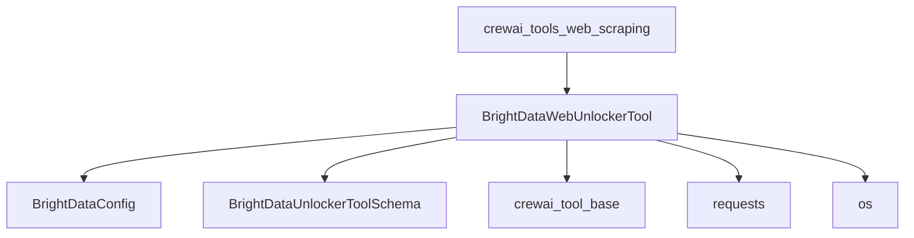

# `brightdata_integration` Module Documentation

## Introduction
The `brightdata_integration` module provides tools for performing advanced web scraping using the Bright Data Web Unlocker API. This module is designed to enable automated and programmatic access to web pages, effectively bypassing common bot protection mechanisms such as CAPTCHA, geo-restrictions, and anti-bot detection through Bright Data's robust proxy infrastructure.

It serves as a key component within the [crewai_tools_web_scraping](crewai_tools_web_scraping.md) ecosystem, offering a powerful solution for agents requiring reliable and unhindered access to web content.

## Architecture and Component Relationships

<!-- DIAGRAM_JSON
{
    "direction": "TD",
    "nodes": [
        {"id": "brightdata_web_unlocker_tool", "label": "BrightDataWebUnlockerTool", "type": "component", "link": null},
        {"id": "brightdata_config", "label": "BrightDataConfig", "type": "component", "link": null},
        {"id": "brightdata_unlocker_tool_schema", "label": "BrightDataUnlockerToolSchema", "type": "component", "link": null},
        {"id": "crewai_tools_web_scraping", "label": "crewai_tools_web_scraping", "type": "external", "link": "crewai_tools_web_scraping.md"},
        {"id": "crewai_tool_base", "label": "crewai_tool_base", "type": "external", "link": "crewai_tool_base.md"},
        {"id": "requests_library", "label": "requests", "type": "external", "link": null},
        {"id": "os_module", "label": "os", "type": "external", "link": null}
    ],
    "edges": [
        {"source": "brightdata_web_unlocker_tool", "target": "brightdata_config"},
        {"source": "brightdata_web_unlocker_tool", "target": "brightdata_unlocker_tool_schema"},
        {"source": "brightdata_web_unlocker_tool", "target": "crewai_tool_base"},
        {"source": "brightdata_web_unlocker_tool", "target": "requests_library"},
        {"source": "brightdata_web_unlocker_tool", "target": "os_module"},
        {"source": "crewai_tools_web_scraping", "target": "brightdata_web_unlocker_tool"}
    ],
    "groups": []
}
-->

## How the Module Fits into the Overall System
The `brightdata_integration` module is a specialized sub-module of `crewai_tools_web_scraping`. It extends the web scraping capabilities of the CrewAI framework by integrating with Bright Data's Web Unlocker. This integration allows agents within the CrewAI system to perform web scraping on challenging websites that employ anti-bot measures, ensuring robust data collection for various tasks.

It relies on the `crewai_tool_base` module for its fundamental tool structure and integrates external libraries like `requests` for making HTTP calls to the Bright Data API.

## Core Components

### `BrightDataWebUnlockerTool`
This class provides the primary functionality for interacting with the Bright Data Web Unlocker API.

**Purpose:**
The `BrightDataWebUnlockerTool` facilitates automated web scraping by routing requests through Bright Data's infrastructure. It's designed to overcome bot protection, geo-restrictions, and other obstacles that typically hinder direct web scraping.

**Key Attributes:**
*   `name` (str): Defaults to "Bright Data Web Unlocker Scraping".
*   `description` (str): Describes its function: "Tool to perform web scraping using Bright Data Web Unlocker".
*   `args_schema` (Type[BaseModel]): Uses `BrightDataUnlockerToolSchema` to define the expected input arguments, such as `url`, `format`, and `data_format`.
*   `_config` (BrightDataConfig): An internal configuration object loaded from environment variables.
*   `base_url` (str): The API endpoint for Bright Data.
*   `api_key` (str): Bright Data API key, sourced from the `BRIGHT_DATA_API_KEY` environment variable.
*   `zone` (str): Bright Data zone identifier, sourced from the `BRIGHT_DATA_ZONE` environment variable.
*   `url` (str | None): The URL to be scraped, can be provided during initialization or method call.
*   `format` (str): The desired response format from Bright Data (e.g., "raw").
*   `data_format` (str): Specifies the format of the extracted data, currently supporting "html" and "markdown".

**Methods:**
*   `__init__(self, url: str | None = None, format: str = "raw", data_format: str = "markdown", **kwargs: Any)`:
    *   Initializes the tool, setting up the `base_url`, `url`, `format`, and `data_format`.
    *   Retrieves `api_key` and `zone` from environment variables, raising `ValueError` if they are not set.
*   `_run(self, url: str | None = None, format: str | None = None, data_format: str | None = None, **kwargs: Any) -> Any`:
    *   This is the core execution method for the tool.
    *   Constructs a payload with the target `url`, `zone`, and `format`.
    *   Validates `data_format` to be either "html" or "markdown".
    *   Sets up authorization headers using the `api_key`.
    *   Sends a POST request to the Bright Data Web Unlocker API using the `requests` library.
    *   Handles HTTP errors and other exceptions during the request, returning informative error messages.
    *   Returns the `response.text` upon successful execution.

**Dependencies:**
*   `BaseTool` from [crewai_tool_base](crewai_tool_base.md)
*   `BrightDataConfig` (internal to brightdata_tool)
*   `BrightDataUnlockerToolSchema` (internal to brightdata_tool)
*   `requests` library for making HTTP requests.
*   `os` module for accessing environment variables.
