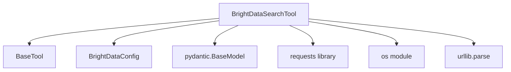

# brightdata_search_tool

## Introduction

The `brightdata_search_tool` module provides a robust web search tool that leverages the Bright Data SERP (Search Engine Results Page) API. This tool enables agents to perform web searches on various search engines, such as Google and Bing, and retrieve either structured search results or the raw content of the search engine page.

## Architecture and Component Relationships

The `brightdata_search_tool` module primarily consists of the `BrightDataSearchTool` class, which encapsulates the logic for interacting with the Bright Data SERP API. It depends on external modules for its core functionality, including a base tool class, configuration management, and HTTP request handling.

<!-- DIAGRAM_JSON
{
    "direction": "TD",
    "nodes": [
        {"id": "brightdata_search_tool", "label": "BrightDataSearchTool", "type": "component", "link": null},
        {"id": "base_tool", "label": "BaseTool", "type": "external", "link": "crewai_tool_base.md"},
        {"id": "brightdata_config", "label": "BrightDataConfig", "type": "external", "link": "brightdata_tools.md"},
        {"id": "pydantic_basemodel", "label": "pydantic.BaseModel", "type": "external", "link": null},
        {"id": "requests", "label": "requests library", "type": "external", "link": null},
        {"id": "os_module", "label": "os module", "type": "external", "link": null},
        {"id": "urllib_parse", "label": "urllib.parse", "type": "external", "link": null}
    ],
    "edges": [
        {"source": "brightdata_search_tool", "target": "base_tool"},
        {"source": "brightdata_search_tool", "target": "brightdata_config"},
        {"source": "brightdata_search_tool", "target": "pydantic_basemodel"},
        {"source": "brightdata_search_tool", "target": "requests"},
        {"source": "brightdata_search_tool", "target": "os_module"},
        {"source": "brightdata_search_tool", "target": "urllib_parse"}
    ],
    "groups": []
}
-->

## Core Functionality

### `BrightDataSearchTool` Class

The `BrightDataSearchTool` class is the primary component of this module. It is a specialized tool designed for performing web searches through the Bright Data SERP API.

**Key Features:**

*   **Web Search Capabilities:** Allows agents to perform search queries across various search engines like Google and Bing.
*   **Configurable Search Parameters:** Supports customization of search parameters such as `search_engine`, `country`, `language`, `search_type` (e.g., news, images, jobs), `device_type` (e.g., desktop, mobile), and the number of results.
*   **Structured Results or Raw Content:** Can be configured to return parsed, structured data from the search results or the raw HTML content of the search engine page.
*   **Environment Variable Integration:** Securely retrieves Bright Data API key (`BRIGHT_DATA_API_KEY`) and zone (`BRIGHT_DATA_ZONE`) from environment variables, ensuring secure access to the API.

**Attributes:**

*   `name` (str): The name of the tool, typically "Bright Data SERP Search".
*   `description` (str): A description explaining the tool's purpose.
*   `args_schema` (Type[BaseModel]): A Pydantic schema (`BrightDataSearchToolSchema`) used for validating the arguments passed to the tool.
*   `base_url` (str): The API endpoint for Bright Data.
*   `api_key` (str): The Bright Data API key.
*   `zone` (str): The Bright Data zone identifier.
*   `query` (str | None): The search query string.
*   `search_engine` (str): The search engine to target (default: "google").
*   `country` (str): The country code for geotargeting (default: "us").
*   `language` (str): The language code for the search (default: "en").
*   `search_type` (str | None): Specifies the type of search, such as "nws" for news or "jobs" for job listings.
*   `device_type` (str): The device type to simulate (default: "desktop").
*   `parse_results` (bool): A flag indicating whether to parse results into structured data or return raw page content (default: True).

**Methods:**

*   `__init__(...)`: Initializes the tool, setting default parameters and retrieving API credentials from environment variables. Raises `ValueError` if `BRIGHT_DATA_API_KEY` or `BRIGHT_DATA_ZONE` are not set.
*   `get_search_url(engine: str, query: str) -> str`: Constructs the appropriate search URL based on the specified search `engine` and `query`.
*   `_run(...) -> Any`: Executes the web search. It constructs the Bright Data API request payload, sends a POST request, and processes the response. It handles various search parameters, URL encoding, and error conditions, returning the search results as a dictionary (if `parse_results` is True) or raw text.

## Integration with the System

This `brightdata_search_tool` module integrates into the larger system as a specialized tool available for agents to perform web searches. It falls under the `crewai_tools_platform_automation` module, which groups various tools for automating platform-specific tasks and leveraging external services.

By encapsulating the complexities of interacting with the Bright Data SERP API, this module provides a clean and consistent interface for agents to retrieve timely and relevant information from the web. Agents can utilize this tool within their tasks to gather data, research topics, or monitor search engine results, enhancing their ability to act as intelligent information retrievers. It relies on the [crewai_tool_base.md](crewai_tool_base.md) for its fundamental structure as a tool and on the [brightdata_tools.md](brightdata_tools.md) for shared Bright Data configurations.
