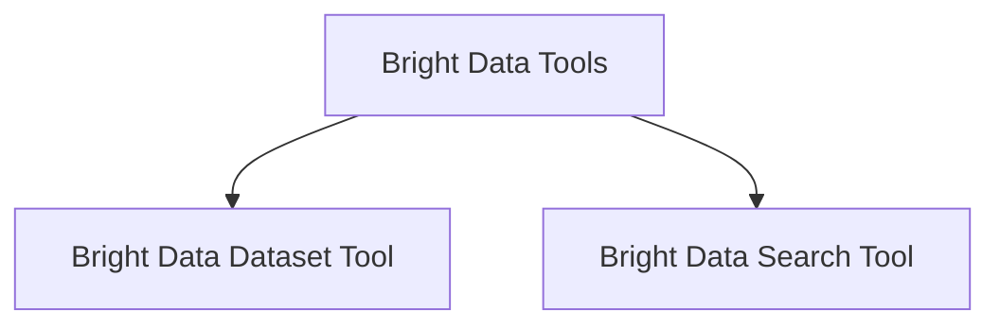

# Bright Data Tools Module

## Introduction

The `brightdata_tools` module provides a set of powerful tools for integrating with Bright Data services, offering functionalities for structured data scraping via their Dataset API and comprehensive web search capabilities through their SERP API. These tools are designed to extend the capabilities of AI agents, allowing them to gather specific data from the web efficiently and reliably.

## Architecture Overview

The `brightdata_tools` module is composed of two primary sub-modules:

- **Bright Data Dataset Tool**: Focuses on extracting structured datasets from specified URLs.
- **Bright Data Search Tool**: Handles web search queries using various search engines and provides either parsed results or raw content.

These sub-modules are designed to work independently but can be orchestrated to achieve complex data acquisition tasks within an AI agent's workflow.

<!-- DIAGRAM_JSON
{
    "direction": "TD",
    "nodes": [
        {"id": "brightdata_dataset_tool", "label": "Bright Data Dataset Tool", "type": "module", "link": "brightdata_dataset_tool.md"},
        {"id": "brightdata_search_tool", "label": "Bright Data Search Tool", "type": "module", "link": "brightdata_search_tool.md"}
    ],
    "edges": [
        {"source": "brightdata_tools", "target": "brightdata_dataset_tool"},
        {"source": "brightdata_tools", "target": "brightdata_search_tool"}
    ],
    "groups": []
}
-->

## Sub-modules

### [Bright Data Dataset Tool](brightdata_dataset_tool.md)
This sub-module provides the `BrightDataDatasetTool` class, which allows agents to scrape structured data from web pages using the Bright Data Dataset API. It supports specifying dataset types, URLs, and additional parameters for tailored data extraction.

### [Bright Data Search Tool](brightdata_search_tool.md)
This sub-module contains the `BrightDataSearchTool` class, enabling agents to perform web searches across various search engines (e.g., Google, Bing, Yandex) using Bright Data's SERP API. It can return either parsed, structured search results or the raw HTML content of the search results page, with options for geo-targeting, language, and device type simulation.