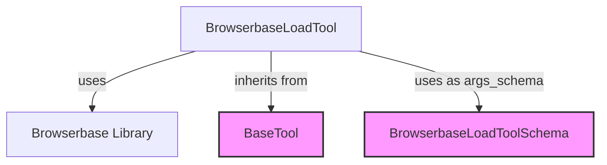

# `browserbase_integration` Module Documentation

## Introduction
The `browserbase_integration` module provides tools for integrating with Browserbase, a service that offers headless browser capabilities for web loading and scraping. This module specifically offers a tool to load web page content using Browserbase, making it easy for agents to interact with dynamic web content.

## Core Functionality

The primary component of this module is the `BrowserbaseLoadTool`, which allows agents to load the content of a given URL using Browserbase's headless browser infrastructure. This tool is particularly useful for scenarios where direct HTTP requests are insufficient due to JavaScript rendering or other dynamic content loading mechanisms.

### `BrowserbaseLoadTool`

The `BrowserbaseLoadTool` class, inheriting from `BaseTool`, facilitates loading web page content. It handles the instantiation of the Browserbase client and the execution of the URL loading operation.

**Key Features:**
*   **Headless Browser Integration**: Utilizes Browserbase to load web pages in a real browser environment.
*   **Configurable Output**: Can return either the full HTML content or just the text content of the page.
*   **Session Management**: Supports the use of session IDs for persistent browser sessions.
*   **Proxy Support**: Allows routing requests through proxies.
*   **Dependency Management**: Automatically prompts for installation of the `browserbase` package if not found.

**Configuration:**
The tool requires a Browserbase API key and optionally a project ID, which can be provided during instantiation or through environment variables (`BROWSERBASE_API_KEY`, `BROWSERBASE_PROJECT_ID`).

**Usage:**
The `_run` method of the `BrowserbaseLoadTool` takes a URL as input and returns the loaded web page content.

## Architecture and Component Relationships

The `browserbase_integration` module is a leaf module within the `crewai_tools_web_scraping` ecosystem. It encapsulates the direct interaction with the Browserbase service.

<!-- DIAGRAM_JSON
{
    "direction": "TD",
    "nodes": [
        {"id": "browserbase_load_tool", "label": "BrowserbaseLoadTool", "type": "component", "link": null},
        {"id": "browserbase_library", "label": "Browserbase Library", "type": "external", "link": null},
        {"id": "base_tool", "label": "BaseTool", "type": "external", "link": "crewai_tool_base.md"},
        {"id": "browserbase_load_tool_schema", "label": "BrowserbaseLoadToolSchema", "type": "external", "link": "crewai_tool_base.md"}
    ],
    "edges": [
        {"source": "browserbase_load_tool", "target": "browserbase_library", "label": "uses"},
        {"source": "browserbase_load_tool", "target": "base_tool", "label": "inherits from"},
        {"source": "browserbase_load_tool", "target": "browserbase_load_tool_schema", "label": "uses as args_schema"}
    ],
    "groups": []
}
-->

## How the Module Fits into the Overall System

The `browserbase_integration` module enhances the web scraping capabilities of the CrewAI system by providing a robust way to interact with dynamic web content. It is part of the `crewai_tools_web_scraping` suite, offering a specialized tool alongside other web scraping and search integrations. This allows agents to perform tasks requiring advanced browser interactions, such as scraping data from JavaScript-rendered pages, filling forms, or navigating complex web applications, contributing to a more versatile and powerful agent ecosystem.

This module depends on the `crewai_tool_base` module for its foundational `BaseTool` and `BaseModel` classes, ensuring consistency and adherence to the overall tool framework within CrewAI.
