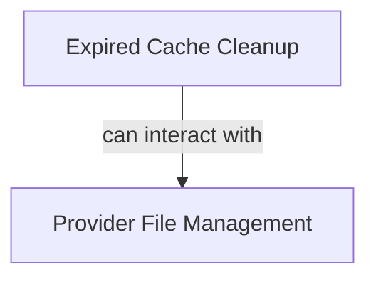

# Cache Cleanup Module

## Introduction

The `cache_cleanup` module is responsible for managing and purging cached files within the CrewAI system. It provides functionalities to remove expired files, clean up files associated with specific storage providers, and ensure the integrity and efficiency of the file cache.

This module offers both synchronous and asynchronous operations to handle file deletions, making it adaptable to different application contexts and performance requirements.

## Architecture Overview

The `cache_cleanup` module is structured into two main sub-modules, each addressing a specific aspect of file cleanup:

1.  **[Expired Cache Cleanup](expired_cache_cleanup.md)**: Focuses on identifying and removing files that have passed their expiration date.
2.  **[Provider File Management](provider_file_management.md)**: Manages the deletion of files directly from various storage providers, either individually or in bulk.

<!-- DIAGRAM_JSON
{
    "direction": "TD",
    "nodes": [
        {"id": "expired_cache_cleanup", "label": "Expired Cache Cleanup", "type": "module", "link": "expired_cache_cleanup.md"},
        {"id": "provider_file_management", "label": "Provider File Management", "type": "module", "link": "provider_file_management.md"}
    ],
    "edges": [
        {"source": "expired_cache_cleanup", "target": "provider_file_management", "label": "can interact with"}
    ],
    "groups": []
}
-->

## Sub-modules

### Expired Cache Cleanup

This sub-module provides utilities for cleaning up files from the cache that have reached their expiration time. It includes both synchronous (`cleanup_expired_files`) and asynchronous (`acleanup_expired_files`) functions for flexible integration. It also handles the optional deletion of these expired files from the actual storage providers.

For more details, refer to the [Expired Cache Cleanup Documentation](expired_cache_cleanup.md).

### Provider File Management

This sub-module is dedicated to managing and cleaning up files directly with various configured storage providers. It offers functions to delete all files associated with a specific provider, as well as individual file deletions. Both synchronous (`cleanup_provider_files`) and asynchronous (`acleanup_provider_files`, `acleanup_uploaded_files`) operations are supported.

For more details, refer to the [Provider File Management Documentation](provider_file_management.md).