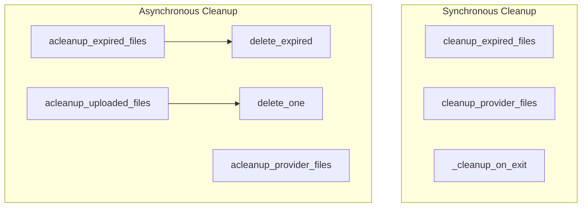

# cache_management
This module provides synchronous and asynchronous functions for managing and cleaning up cached files, including expired entries and provider-specific uploads.

<!-- DIAGRAM_JSON
{
    "nodes": [
        {
            "id": "cleanup_expired_files",
            "label": "cleanup_expired_files"
        },
        {
            "id": "cleanup_provider_files",
            "label": "cleanup_provider_files"
        },
        {
            "id": "acleanup_provider_files",
            "label": "acleanup_provider_files"
        },
        {
            "id": "acleanup_uploaded_files",
            "label": "acleanup_uploaded_files"
        },
        {
            "id": "acleanup_expired_files",
            "label": "acleanup_expired_files"
        },
        {
            "id": "_cleanup_on_exit",
            "label": "_cleanup_on_exit"
        },
        {
            "id": "delete_expired",
            "label": "delete_expired"
        },
        {
            "id": "delete_one",
            "label": "delete_one"
        }
    ],
    "edges": [
        {
            "source": "acleanup_expired_files",
            "target": "delete_expired"
        },
        {
            "source": "acleanup_uploaded_files",
            "target": "delete_one"
        }
    ],
    "groups": [
        {
            "id": "sync_cleanup",
            "label": "Synchronous Cleanup",
            "nodes": [
                "cleanup_expired_files",
                "cleanup_provider_files",
                "_cleanup_on_exit"
            ]
        },
        {
            "id": "async_cleanup",
            "label": "Asynchronous Cleanup",
            "nodes": [
                "acleanup_expired_files",
                "delete_expired",
                "acleanup_provider_files",
                "acleanup_uploaded_files",
                "delete_one"
            ]
        }
    ]
}
-->
