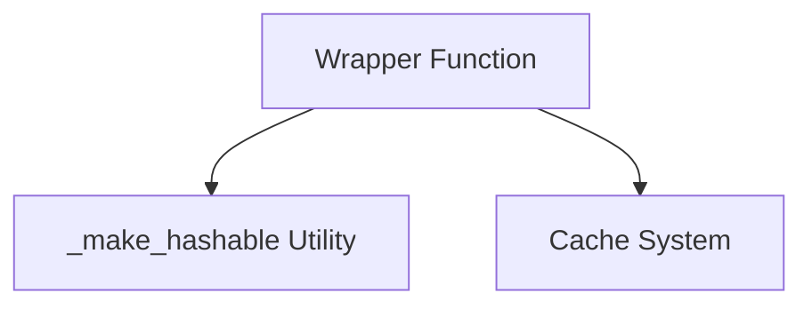

# Caching Mechanism Module

## Introduction

The `caching_mechanism` module provides a robust and efficient caching solution for asynchronous operations within the CrewAI project structure. Its primary goal is to enhance application performance by storing and retrieving results of computationally intensive or frequently accessed asynchronous method calls, thereby avoiding redundant executions.

This module integrates seamlessly into the project's utility layer, specifically designed to wrap asynchronous functions and manage their cached outputs based on their input parameters.

## Architecture and Component Relationships

The `caching_mechanism` module centers around a decorator-like `wrapper` function that intercepts calls to asynchronous methods. It relies on an external caching system to store and retrieve data. The `_make_hashable` utility is used internally to generate consistent cache keys from diverse input arguments.

<!-- DIAGRAM_JSON
{
    "direction": "TD",
    "nodes": [
        {"id": "wrapper", "label": "Wrapper Function", "type": "component", "link": null},
        {"id": "make_hashable", "label": "_make_hashable Utility", "type": "component", "link": null},
        {"id": "cache_system", "label": "Cache System", "type": "external", "link": "crewai_files_cache.md"}
    ],
    "edges": [
        {"source": "wrapper", "target": "make_hashable"},
        {"source": "wrapper", "target": "cache_system"}
    ],
    "groups": []
}
-->


### Components

#### Wrapper Function (`lib.crewai.src.crewai.project.utils.wrapper`)

This is the core component of the caching mechanism. It is an asynchronous function designed to wrap other asynchronous methods. Its responsibilities include:

1.  **Cache Key Generation**: It converts the input arguments (`*args` and `**kwargs`) of the wrapped method into a hashable format using the internal `_make_hashable` utility. This hashable representation forms the unique `cache_key`.
2.  **Cache Lookup**: Before executing the wrapped method, it attempts to read a result from the `cache` system using the generated `cache_key` and the method's name as the tool identifier.
3.  **Execution and Caching**: If a cached result is found, it is immediately returned, bypassing the original method's execution. If no cached result exists, the original asynchronous method (`meth`) is awaited. Its result is then added to the `cache` before being returned.

```python
    async def wrapper(*args: P.args, **kwargs: P.kwargs) -> R:
        hashable_args = tuple(_make_hashable(arg) for arg in args)
        hashable_kwargs = tuple(
            sorted((k, _make_hashable(v)) for k, v in kwargs.items())
        )
        cache_key = str((hashable_args, hashable_kwargs))

        cached_result: R | None = cache.read(tool=meth.__name__, input=cache_key)
        if cached_result is not None:
            return cached_result

        result = await meth(*args, **kwargs)
        cache.add(tool=meth.__name__, input=cache_key, output=result)
        return result
```

#### `_make_hashable` Utility

This is an internal helper function (not explicitly provided in the core components but inferred from usage) responsible for converting arbitrary Python objects (including lists, dictionaries, and custom objects) into a hashable format suitable for use as a cache key. This ensures consistent key generation regardless of the input argument types.

## Integration with the Overall System

The `caching_mechanism` module is nested under `crewai_project_structure.project_core_mechanisms`, indicating its role as a fundamental utility for project-level operations. It provides a performance optimization layer for various asynchronous tasks across the CrewAI framework.

Its dependency on the `Cache System` (likely handled by the `crewai_files_cache` module, see [crewai_files_cache.md](crewai_files_cache.md)) highlights its reliance on a centralized caching infrastructure to manage stored data effectively. By abstracting the caching logic, this module allows developers to easily apply caching to their asynchronous functions without direct interaction with the underlying cache implementation.