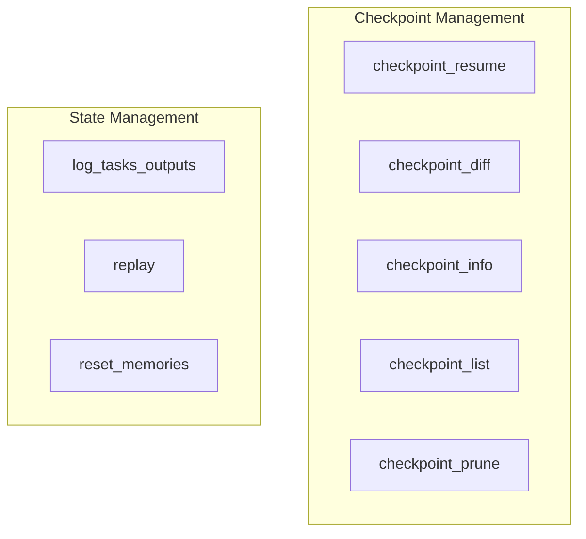

# checkpoint_and_state
This module provides command-line interface functions for managing execution checkpoints and various aspects of the crew's operational state, including task outputs and memories.

<!-- DIAGRAM_JSON
{
    "nodes": [
        {
            "id": "checkpoint_resume",
            "label": "checkpoint_resume"
        },
        {
            "id": "checkpoint_diff",
            "label": "checkpoint_diff"
        },
        {
            "id": "checkpoint_info",
            "label": "checkpoint_info"
        },
        {
            "id": "checkpoint_list",
            "label": "checkpoint_list"
        },
        {
            "id": "checkpoint_prune",
            "label": "checkpoint_prune"
        },
        {
            "id": "log_tasks_outputs",
            "label": "log_tasks_outputs"
        },
        {
            "id": "replay",
            "label": "replay"
        },
        {
            "id": "reset_memories",
            "label": "reset_memories"
        }
    ],
    "edges": [],
    "groups": [
        {
            "id": "checkpoint_management",
            "label": "Checkpoint Management",
            "nodes": [
                "checkpoint_resume",
                "checkpoint_diff",
                "checkpoint_info",
                "checkpoint_list",
                "checkpoint_prune"
            ]
        },
        {
            "id": "state_management",
            "label": "State Management",
            "nodes": [
                "log_tasks_outputs",
                "replay",
                "reset_memories"
            ]
        }
    ]
}
-->
