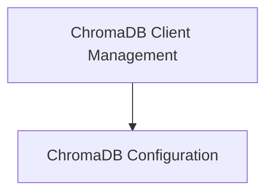

# ChromaDB Integration Module

The `chromadb_integration` module provides the necessary components for integrating ChromaDB as a vector database within the CrewAI RAG system. It handles the configuration of ChromaDB settings and the creation of client instances, facilitating efficient and persistent vector storage and retrieval.

## Architecture Overview

The `chromadb_integration` module is structured into two main sub-modules:

1.  **ChromaDB Configuration (`chromadb_configuration.md`)**: Manages the default and configurable settings for ChromaDB instances.
2.  **ChromaDB Client Management (`chromadb_client_management.md`)**: Handles the creation and initialization of ChromaDB client instances.

These sub-modules work together to ensure that ChromaDB is properly set up and accessible for vector operations within the CrewAI framework.

<!-- DIAGRAM_JSON
{
    "direction": "TD",
    "nodes": [
        {"id": "chromadb_configuration", "label": "ChromaDB Configuration", "type": "module", "link": "chromadb_configuration.md"},
        {"id": "chromadb_client_management", "label": "ChromaDB Client Management", "type": "module", "link": "chromadb_client_management.md"}
    ],
    "edges": [
        {"source": "chromadb_client_management", "target": "chromadb_configuration"}
    ],
    "groups": []
}
-->

## Sub-modules

### [ChromaDB Configuration](chromadb_configuration.md)

This sub-module focuses on defining and managing the configuration settings for ChromaDB. It includes functions to set up default parameters like persistence directory, telemetry settings, and other operational configurations.

### [ChromaDB Client Management](chromadb_client_management.md)

This sub-module is responsible for the actual instantiation and management of the ChromaDB client. It handles the creation of necessary directories, applies locking mechanisms to ensure safe client access, and integrates the configured settings and embedding functions into the client instance.