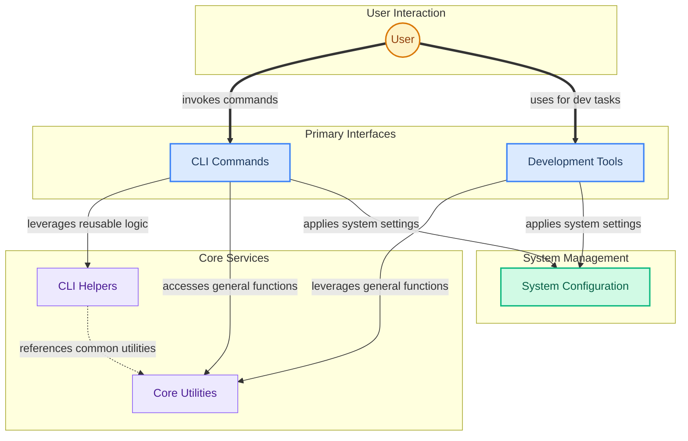

The `cli_and_dev_utils` module provides a comprehensive set of command-line interface (CLI) tools and development utilities for managing CrewAI projects. It empowers users to execute crews and flows, manage checkpoints, deploy and integrate custom tools, configure system settings, and leverage experimental evaluation features. This module centralizes essential functionalities for both running and developing CrewAI applications, streamlining workflows from setup to deployment and monitoring.

### How the Module's Components Work Together

The `cli_and_dev_utils` module is structured into several sub-modules that work in concert to provide a robust development and operational experience. The user interacts directly with the `CLI Commands` and `Development Tools` modules, which in turn leverage `CLI Helpers`, `Core Utilities`, and `System Configuration` for their operations.

### Core Components Documentation

*   **CLI Commands**: Provides the main entry points for all command-line operations, including `run`, `chat`, `deploy`, `tool_create`, `checkpoint_resume`, and `traces_enable`.
    *   [lib.crewai.src.crewai.cli.cli.run](lib.crewai.src.crewai.cli.cli.run)
    *   [lib.crewai.src.crewai.cli.cli.deploy_create](lib.crewai.src.crewai.cli.cli.deploy_create)
    *   [lib.crewai.src.crewai.cli.cli.checkpoint_resume](lib.crewai.src.crewai.cli.cli.checkpoint_resume)

*   **CLI Helpers**: Offers foundational utilities and base classes that support the CLI commands, such as `BaseCommand` for defining new commands and `copy_template_files` for project scaffolding.
    *   [lib.crewai.src.crewai.cli.command.BaseCommand](lib.crewai.src.crewai.cli.command.BaseCommand)
    *   [lib.crewai.src.crewai.cli.create_crew.copy_template_files](lib.crewai.src.crewai.cli.create_crew.copy_template_files)

*   **Development Tools**: Contains utilities for developers, including CLI tools for version management (`tag`, `bump`), documentation checks (`docs_check`), and experimental evaluation components like `BaseEvaluator` and `run_experiment`.
    *   [lib.devtools.src.crewai_devtools.cli.tag](lib.devtools.src.crewai_devtools.cli.tag)
    *   [lib.crewai.src.crewai.experimental.evaluation.base_evaluator.BaseEvaluator](lib.crewai.src.crewai.experimental.evaluation.base_evaluator.BaseEvaluator)

*   **Core Utilities**: Centralizes essential functions for various aspects of CrewAI, such as agent logging (`show_agent_logs`), file management (`get_files`), data serialization (`to_string`), and streaming output handling (`stream_handler`).
    *   [lib.crewai.src.crewai.utilities.agent_utils.show_agent_logs](lib.crewai.src.crewai.utilities.agent_utils.show_agent_logs)
    *   [lib.crewai.src.crewai.utilities.file_store.get_files](lib.crewai.src.crewai.utilities.file_store.get_files)
    *   [lib.crewai.src.crewai.utilities.streaming.stream_handler](lib.crewai.src.crewai.utilities.streaming.stream_handler)

*   **System Configuration**: Manages global system settings, security configurations (`SecurityConfig`), resource loading (`load_resources`), and type conversions like `string_to_callable`.
    *   [lib.crewai.src.crewai.security.security_config.SecurityConfig](lib.crewai.src.crewai.security.security_config.SecurityConfig)
    *   [lib.crewai.src.crewai.skills.loader.load_resources](lib.crewai.src.crewai.skills.loader.load_resources)
    *   [lib.crewai.src.crewai.types.callback.string_to_callable](lib.crewai.src.crewai.types.callback.string_to_callable)