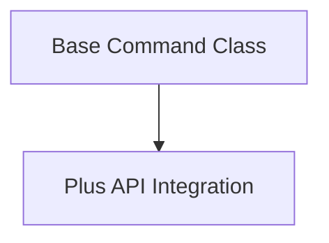

# CLI Base Commands Module Documentation

## Introduction

The `cli_base_commands` module provides the fundamental building blocks for CrewAI's command-line interface (CLI). It defines base classes and mixins that ensure consistent behavior, telemetry integration, and seamless interaction with the CrewAI+ API across all CLI commands.

## Architecture Overview

The module's architecture is designed to be extensible, allowing new CLI commands to inherit core functionalities without redundant code. It primarily consists of a base command class and a mixin for API interactions, facilitating a clean separation of concerns.

<!-- DIAGRAM_JSON
{
    "direction": "TD",
    "nodes": [
        {"id": "command_base", "label": "Base Command Class", "type": "module", "link": "command_base.md"},
        {"id": "plus_api_integration", "label": "Plus API Integration", "type": "module", "link": "plus_api_integration.md"}
    ],
    "edges": [
        {"source": "command_base", "target": "plus_api_integration"}
    ],
    "groups": []
}
-->

## High-Level Functionality

### [Base Command Class](command_base.md)

This sub-module defines the `BaseCommand` class, which all CLI commands inherit from. It sets up essential functionalities such as telemetry tracking, ensuring that command usage and errors are properly logged for analytical purposes.

### [Plus API Integration](plus_api_integration.md)

The `PlusAPIMixin` provides capabilities for interacting with the CrewAI+ API. It handles user authentication, securely communicates with the API, and includes robust error validation to ensure reliable data exchange and user feedback. This mixin abstracts away the complexities of API communication, allowing commands to focus on their specific logic.
